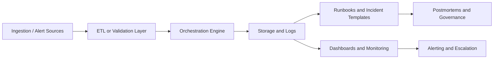

# ML Incident Response Playbook + Runbook System


[](https://mlops.zrl.dev)


[](https://github.com/zrlopez/ml-incident-response-playbook/actions/workflows/secured_ci.yml)
[](https://codecov.io/gh/zrlopez/ml-incident-response-playbook)
[](https://app.codacy.com/gh/zrlopez/ml-incident-response-playbook/dashboard?utm_source=gh&utm_medium=referral&utm_content=&utm_campaign=Badge_grade)

## Quick Proof of Quality

| Signal | Evidence |
|---|---|
| Security toolchain | TruffleHog + Bandit + semgrep + Trivy + CodeQL + pip-audit + SBOM ([`secured_ci.yml`](.github/workflows/secured_ci.yml)) |
| Supply-chain hardening | All GitHub Actions pinned to SHA digests |
| Test coverage | ≥75% unit, ≥60% integration (enforced in CI) |
| Type safety | mypy strict mode, Pydantic models on all API shapes |
| Architecture decisions | [ADR directory](docs/decisions/) — 5 decisions documented |
| Runbook maturity | 7 runbooks with Prometheus-bound thresholds + validation log |
| Live deployment | [huggingface.co/spaces/zrlo/ml-incident-api](https://huggingface.co/spaces/zrlo/ml-incident-api) |
| Operational docs | [mlops.zrl.dev](https://mlops.zrl.dev) |

A production-style operational documentation repo for ML and AI incident response.

## Business Overview

When AI systems fail in production, teams lose time if incident handling depends on tribal knowledge. This repository simulates a documented operational response layer for AI/ML systems so responders can triage faster, escalate cleanly, and recover with less ambiguity.

## Technical Overview

This repo combines Markdown runbooks, Mermaid decision trees, validation templates, sample operational logs, lightweight Python utilities, and DevOps-ready support files. It is intentionally structured like an enterprise knowledge base for MLOps, Data Ops, and platform support teams.

## Architecture Summary



## What This Demonstrates

This project showcases a production-grade MLOps incident-response system built with security and observability as first-class concerns. It demonstrates:

- **Hardened FastAPI service** — JWT RS256 auth, per-user rate limiting, async Redis denylist, GDPR pseudonymisation, structured logging via structlog, and OpenTelemetry tracing.
- **ML layer** — IsolationForest anomaly detector with a thread-safe model registry, reproducible training pipeline, and a JWT-protected inference endpoint.
- **Supply-chain security** — SHA-pinned GitHub Actions, Trivy container scanning, Bandit SAST, TruffleHog secret scanning, pip-audit dependency auditing, and Dependabot auto-bumps.
- **Operational runbooks** — Five incident runbooks with Mermaid decision trees, a severity matrix, escalation templates, and postmortem artifacts.
- **Engineering rigour** — 530+ unit tests, ≥68% coverage gate, mypy type checking, ruff linting, `CODEOWNERS`, and a full MkDocs documentation site.

## Feature Highlights

- Five incident runbooks with decision-tree flowcharts.
- Severity matrix and escalation templates.
- Sample incident logs and postmortem artifacts.
- Starter Python modules for logging, incident tracking, validation, and anomaly checks.
- Documentation pages for onboarding, governance, deployment, setup, and monitoring.
- CI-ready repository structure with Docker and hardened GitHub Actions workflows.

## Repository Structure

```text
ml-incident-response-playbook/
├── .github/
│   └── workflows/
│       ├── secured_ci.yml         # Hardened CI pipeline (TruffleHog, Bandit, mypy, Trivy, SBOM)
│       ├── codeql.yml             # GitHub CodeQL analysis workflow
│       └── deploy-hf.yml          # Hugging Face Spaces deploy workflow
├── api/                           # FastAPI application code
├── alembic/                       # Database migration environment
├── configs/                       # Environment and service configuration files
├── dashboards/                    # Grafana or observability dashboard definitions
├── dbt/                           # dbt models and data transformation layer
├── docs/
│   ├── diagrams/                  # Mermaid flowcharts for each incident type
│   ├── templates/                 # Escalation, postmortem, and update templates
│   └── policies/                  # Governance and security policy documents
├── examples/                      # Sample incident logs and postmortem artifacts
├── infrastructure/                # IaC and deployment manifests
├── metrics/                       # KPI definitions and metric tracking
├── migrations/                    # Alembic migration scripts
├── ml_models/                     # Model artifacts and evaluation scaffolding
├── observability/                 # Logging helpers, drift checks, anomaly detection
├── orchestration/                 # Airflow DAGs and scheduling templates
├── pipelines/                     # Data pipeline definitions
├── runbooks/                      # Step-by-step incident response runbooks
├── scripts/                       # Utility and seed scripts
├── src/                           # Shared library code
├── tests/                         # Pytest test suite
├── validation/                    # Data validation rules and schema checks
├── Dockerfile
├── Dockerfile.dev
├── docker-compose.yml
├── Makefile
├── pyproject.toml
├── requirements.txt
├── requirements-dev.txt
├── requirements-airflow.txt
├── README.md
└── SECURITY.md
```

## Installation

### Prerequisites

- Git.
- Python 3.11+.
- Docker and Docker Compose.
- A Markdown editor or VS Code.

### Local Development Setup

```bash
git clone https://github.com/zrlopez/ml-incident-response-playbook.git
cd ml-incident-response-playbook
python -m venv .venv
source .venv/bin/activate
pip install -r requirements.txt
```

## Docker Usage

```bash
docker build -t ml-incident-response-playbook .
docker run --rm -p 8080:8080 ml-incident-response-playbook
```

If you use Docker Compose, start the supporting services with:

```bash
docker compose up --build
```

## Orchestration Overview

The repository includes an Airflow-style DAG example and orchestration templates to show how incident checks, validation tasks, and anomaly detection jobs would be scheduled in a production environment.

## Monitoring Overview

Monitoring is centered on incident counts, severity trends, MTTA, MTTR, and repeat incident rate. The repo also includes a monitoring guide and KPI tracking notes to show how operational health would be reviewed over time.

## Observability Overview

Observability is represented through logging helpers, validation rules, sample incident logs, and anomaly-detection scaffolding. These assets demonstrate how production teams would connect alerts, logs, metrics, and incident ownership.

## Sample Workflows

1. Alert fires.
2. Incident is classified by category and severity.
3. The matching runbook is opened.
4. Diagnostic and mitigation steps are executed.
5. The incident is logged and followed by a postmortem.

## Deployment

This service is deployed to [Hugging Face Spaces](https://huggingface.co/spaces/zrlo/ml-incident-api) via a GitHub Actions workflow that syncs `main` to HF on every push. The Docker SDK is used — HF builds and runs the existing `Dockerfile` directly with no additional configuration.

## CI/CD Overview

The repo includes a hardened GitHub Actions pipeline (`secured_ci.yml`) covering secret scanning, dependency auditing, SAST (Bandit + mypy + semgrep), test coverage gating, container scanning with Trivy, and SBOM generation. All actions are pinned to SHA digests. Coverage gates are enforced at two levels: **≥68% on unit tests** (SQLite, fast) and **≥40% on integration tests** (Postgres, full stack). A combined end-to-end coverage figure has not yet been profiled; these gates reflect the current enforced minimums and will be updated as the test suite matures.

## Roadmap

- Add richer sample incident records.
- Expand validation and monitoring examples.
- Add a richer observability demo.

## Contributing

Full contributing guidelines live in [`docs/CONTRIBUTING.md`](docs/CONTRIBUTING.md).

Contributions are welcome — bug fixes, documentation improvements, new runbook
templates, and security hardening are all in scope.

### Before You Start

- Check [open issues](https://github.com/zrlopez/ml-incident-response-playbook/issues)
  to avoid duplicating work.
- For significant changes, open an issue first to discuss the approach.
- All contributors are expected to follow the [Code of Conduct](CODE_OF_CONDUCT.md)
  and the [Security Policy](SECURITY.md).

### Development Setup

```bash
git clone https://github.com/zrlopez/ml-incident-response-playbook.git
cd ml-incident-response-playbook
python -m venv .venv && source .venv/bin/activate
pip install -r requirements.txt
cp .env.example .env          # Fill in required values
alembic upgrade head           # Apply DB migrations
python scripts/seed_users.py --dry-run  # Verify seed config
```

Run the test suite before opening a pull request:

```bash
pytest tests/ -v --tb=short
```

### Branching and Commits

- Branch from `main` using the pattern `type/short-description`:
  `fix/auth-rate-limit`, `feat/rs256-jwks`, `docs/postmortem-template`.
- Keep commits atomic — one logical change per commit.
- Use [Conventional Commits](https://www.conventionalcommits.org/) format:

  ```
  type(scope): short imperative summary

  Optional body explaining WHY, not what.
  Closes #123
  ```

  Valid types: `feat`, `fix`, `docs`, `refactor`, `test`, `chore`, `security`.

### Pull Request Checklist

Before marking your PR ready for review, confirm:

- [ ] `pytest tests/ -v` passes locally with no new failures.
- [ ] New code paths have corresponding tests in `tests/`.
- [ ] Docstrings added for any new public functions or classes.
- [ ] No secrets, credentials, or real PII appear in any file
  (the CI TruffleHog scan will block the merge if found).
- [ ] `MASTER_ACTION_TRACKER.md` updated if your change addresses a tracked finding.
- [ ] `SECURITY.md` updated if you change the security control surface.
- [ ] `.env.example` updated if you add new environment variables.
- [ ] Markdown runbooks or templates follow the existing style
  (heading hierarchy, Mermaid diagram syntax, table formatting).

### Code Style

- Python: follow [PEP 8](https://peps.python.org/pep-0008/).
  Line length: 100 characters. Format with `ruff format .` before committing.
- Type hints required on all new function signatures.
- Structured logging via `structlog` — no bare `print()` in application code.
- Pydantic models for all API request/response shapes.
- No `TODO` comments without a tracking issue number: `# TODO(#42): description`.

### Security Contributions

If your change touches authentication, authorization, secrets handling, or
dependency versions:

- Reference the relevant `ARCH-*` or `CRIT-*` finding ID from `MASTER_ACTION_TRACKER.md`.
- Add or update tests in `tests/test_api.py` covering the security behavior.
- For vulnerability reports, follow the [Security Policy](SECURITY.md) —
  **do not open a public issue for unpatched vulnerabilities**.

### Documentation Contributions

Runbooks, postmortem templates, and policy docs live in `runbooks/`, `templates/`,
and `docs/`. When adding or updating them:

- Keep all examples synthetic — no real hostnames, IPs, usernames, or incident data.
- Mermaid diagrams should render cleanly in GitHub's Markdown preview.
- Link new documents from the relevant index or parent document.

### Maintainer Review SLA

Expect an initial review within **5 business days**. A second review or merge
follows within **10 business days** of the last substantive update.

## License

This project is licensed under the [MIT License](LICENSE).

## Contact

Portfolio: https://zrl.dev

GitHub: https://github.com/zrlopez
