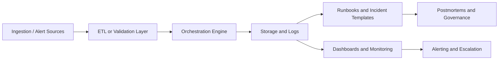

# ML Incident Response Playbook + Runbook System


A production-style operational documentation repo for ML and AI incident response.

## Business Overview

When AI systems fail in production, teams lose time if incident handling depends on tribal knowledge. This repository simulates a documented operational response layer for AI/ML systems so responders can triage faster, escalate cleanly, and recover with less ambiguity.

## Technical Overview

This repo combines Markdown runbooks, Mermaid decision trees, validation templates, sample operational logs, lightweight Python utilities, and DevOps-ready support files. It is intentionally structured like an enterprise knowledge base for MLOps, Data Ops, and platform support teams.

## Architecture Summary



## Feature Highlights

- Five incident runbooks with decision-tree flowcharts.
- Severity matrix and escalation templates.
- Sample incident logs and postmortem artifacts.
- Starter Python modules for logging, incident tracking, validation, and anomaly checks.
- Documentation pages for onboarding, governance, deployment, setup, and monitoring.
- CI-ready repository structure with Docker and workflow templates.

## Repository Structure

```text
ml-incident-response-playbook/
├── runbooks/
├── templates/
├── diagrams/
├── examples/
├── metrics/
├── docs/
├── src/
├── pipelines/
├── orchestration/
├── monitoring/
├── dashboards/
├── configs/
├── infrastructure/
├── tests/
├── scripts/
├── api/
├── ml_models/
├── validation/
├── observability/
└── ci_cd/
```

## Installation

### Prerequisites

- Git.
- Python 3.11+.
- Docker and Docker Compose.
- A Markdown editor or VS Code.

### Local Development Setup

```bash
git clone https://github.com/<your-org>/ml-incident-response-playbook.git
cd ml-incident-response-playbook
python -m venv .venv
source .venv/bin/activate
pip install -r requirements.txt
```

## Docker Usage

```bash
docker build -t ml-incident-response-playbook .
docker run --rm -p 8000:8000 ml-incident-response-playbook
```

If you use Docker Compose, start the supporting services with:

```bash
docker compose up --build
```

## Orchestration Overview

The repository includes an Airflow-style DAG example and orchestration templates to show how incident checks, validation tasks, and anomaly detection jobs would be scheduled in a production environment.

## Monitoring Overview

Monitoring is centered on incident counts, severity trends, MTTA, MTTR, and repeat incident rate. The repo also includes a monitoring guide and KPI tracking notes to show how operational health would be reviewed over time.

## Observability Overview

Observability is represented through logging helpers, validation rules, sample incident logs, and anomaly-detection scaffolding. These assets demonstrate how production teams would connect alerts, logs, metrics, and incident ownership.

## Sample Workflows

1. Alert fires.
2. Incident is classified by category and severity.
3. The matching runbook is opened.
4. Diagnostic and mitigation steps are executed.
5. The incident is logged and followed by a postmortem.

## Screenshots

Add screenshots here to show:

- The README home section.
- A runbook with a Mermaid diagram.
- A sample incident template.
- A dashboard or monitoring mockup.

## Deployment Instructions

This project can be published as a static documentation site with GitHub Pages or MkDocs Material. The repo is also suitable for a lightweight internal-style deployment to mirror production documentation workflows.

## CI/CD Overview

The repo includes a GitHub Actions workflow template for validation, formatting, tests, and documentation checks. This helps demonstrate DevOps maturity and branch-safe delivery practices.

## Roadmap

- Add richer sample incident records.
- Expand validation and monitoring examples.
- Add a docs site build pipeline.
- Add a richer observability demo.
- Add automated Mermaid rendering in CI.

## Contribution Guidelines

- Keep changes focused and small.
- Use clear commit messages.
- Preserve the existing documentation style.
- Keep examples synthetic and professional.
- Update the changelog when structure changes.

## License

MIT License recommended for a public portfolio repository.

## Contact

Portfolio: https://zrl.dev

GitHub: https://github.com/<your-username>
