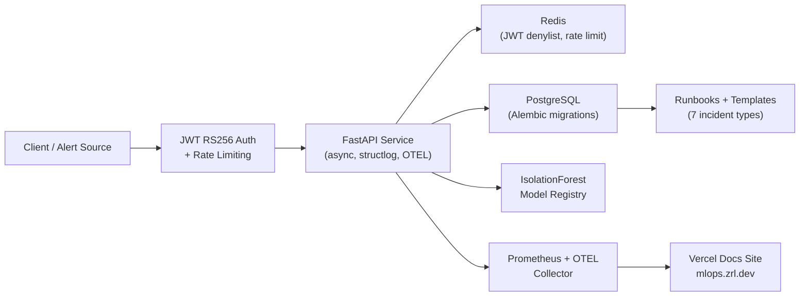

# ML Incident Response Playbook + Runbook System


[](https://mlops.zrl.dev)

[](https://github.com/zrlopez/ml-incident-response-playbook/actions/workflows/secured_ci.yml)
[](https://app.codacy.com/gh/zrlopez/ml-incident-response-playbook/dashboard?utm_source=gh&utm_medium=referral&utm_content=&utm_campaign=Badge_coverage)
[](https://app.codacy.com/gh/zrlopez/ml-incident-response-playbook/dashboard?utm_source=gh&utm_medium=referral&utm_content=&utm_campaign=Badge_grade)


A hardened FastAPI service and operational runbook suite for ML incident response — built to enterprise engineering standards with security and observability as first-class concerns.

**Role target:** MLOps Engineer · Data Operations · Platform Engineering  
**Stack:** Python 3.11 · FastAPI · PostgreSQL · Redis · Docker · GitHub Actions · IsolationForest · Pydantic · mypy · structlog · OpenTelemetry  
**Seniority signal:** Staff-adjacent — 10 ADRs, 7 runbooks, 677-test suite, full supply-chain security, live deployment
**Documentation:** [mlops.zrl.dev](https://mlops.zrl.dev)  
**Live Anomaly Detection Demo:** [huggingface.co/spaces/zrlo/ml-incident-api](https://huggingface.co/spaces/zrlo/ml-incident-api)

---

## Quick Proof of Quality

**If you only have 5 minutes:**

1. Try the [live anomaly detection demo](https://huggingface.co/spaces/zrlo/ml-incident-api).
2. Skim the [operational walkthrough](docs/walkthrough.md) to see the incident lifecycle.
3. Read one runbook, such as [model degradation](runbooks/model_degradation.md).
4. Open the [hardened CI pipeline](.github/workflows/secured_ci.yml).
5. Review the [model card](MODEL_CARD.md) and [ADR-010](docs/adr/ADR-010-anomaly-model-design.md).

> **Design intent:** This is a production-style portfolio implementation. It
> prioritizes operational design, CI/security maturity, incident response
> workflows, and ML system thinking. Some integrations are intentionally
> scaffolded rather than operated as a live production service.

### Evidence Matrix

| Skill signal | Where to look |
|---|---|
| MLOps incident thinking | [`runbooks/`](runbooks/), [`docs/severity_matrix.md`](docs/severity_matrix.md) |
| API/backend engineering | [`api/`](api/), [`src/repositories/`](src/repositories/) |
| Security posture | [`.github/workflows/secured_ci.yml`](.github/workflows/secured_ci.yml), [`SECURITY.md`](SECURITY.md), [`.trivyignore`](.trivyignore) |
| Observability | [`observability/`](observability/), [`dashboards/`](dashboards/), [`docs/monitoring.md`](docs/monitoring.md) |
| ML lifecycle awareness | [`MODEL_CARD.md`](MODEL_CARD.md), [`ADR-010`](docs/adr/ADR-010-anomaly-model-design.md), [`ml_models/`](ml_models/) |
| Data engineering | [`dbt/`](dbt/), [`orchestration/`](orchestration/), [`pipelines/`](pipelines/) |

### Visual Tour

Real screenshots are intentionally kept out until they are captured from the
live surfaces. The capture checklist is tracked in
[`docs/assets/screenshots/README.md`](docs/assets/screenshots/README.md) so the
README can embed actual evidence instead of mock screenshots.

| Signal | Evidence |
|---|---|
| Security toolchain | TruffleHog + Bandit + semgrep + Trivy + CodeQL + pip-audit + SBOM ([`secured_ci.yml`](.github/workflows/secured_ci.yml)) |
| Supply-chain hardening | SHA-pinned GitHub Actions; Cosign container image signing ([`cosign.pub`](cosign.pub)); `.trivyignore` with scoped suppression rules |
| Test suite | 677 unit tests; ≥80% unit coverage gate (SQLite); ≥65% integration coverage gate (Postgres) |
| Type safety | mypy strict mode; Pydantic models on all API shapes |
| Architecture decisions | [ADR directory](docs/adr/) — 10 decisions documented (JWT algorithm, async ORM, Redis denylist, base image, Alembic strategy, OTEL stack, anomaly model design, and more) |
| Runbook maturity | [7 runbooks](runbooks/) with Mermaid decision trees + [validation test log](runbooks/runbook_test_log.md) |
| Security remediation log | [docs/REMEDIATION_LOG.md](docs/REMEDIATION_LOG.md) — live tracking of security findings and resolutions |
| Pre-commit gates | `.pre-commit-config.yaml` — local quality enforcement before CI |
| Model card | [MODEL_CARD.md](MODEL_CARD.md) — ML model documentation per industry standard |
| Live deployment | [huggingface.co/spaces/zrlo/ml-incident-api](https://huggingface.co/spaces/zrlo/ml-incident-api) |
| Operational docs | [mlops.zrl.dev](https://mlops.zrl.dev) — Vercel-hosted docs site; [`docs.yml`](.github/workflows/docs.yml) verifies live-site health |

---

## Overview

When AI systems fail in production, teams lose time if incident handling depends on tribal knowledge. This repository models a documented operational response layer for AI/ML systems — designed to enterprise operational standards so responders can triage faster, escalate cleanly, and recover with less ambiguity.

The implementation combines a hardened FastAPI service, a secured multi-stage CI/CD pipeline, an ML anomaly detection layer, GDPR pseudonymisation, RS256 JWT auth, Alembic-managed migrations, and a full operational runbook suite with postmortem artifacts. Every design decision is documented in an ADR, every security finding is tracked in the remediation log, and every pipeline gate is enforced and versioned.

---

## What This Demonstrates

- **Hardened FastAPI service** — JWT RS256 auth, per-user rate limiting, async Redis denylist, GDPR pseudonymisation, structured logging via structlog, and OpenTelemetry tracing.
- **ML layer** — IsolationForest anomaly detector with a thread-safe model registry, reproducible training pipeline, and a JWT-protected inference endpoint. See [MODEL_CARD.md](MODEL_CARD.md) for full model documentation.
- **Supply-chain security** — SHA-pinned GitHub Actions, Cosign container signing, Trivy container scanning, Bandit SAST, TruffleHog secret scanning, pip-audit dependency auditing, and Dependabot auto-bumps.
- **Operational runbooks** — Seven incident runbooks covering model degradation, API outage, data quality failures, feature store corruption, LLM cost spikes, model rollback, and pipeline failure — each with Mermaid decision trees, a severity matrix, escalation templates, and postmortem artifacts. Runbooks are validated and logged in [`runbook_test_log.md`](runbooks/runbook_test_log.md).
- **Engineering rigour** — 677 unit tests, ≥80% coverage gate, mypy strict mode, ruff linting, `CODEOWNERS`, pre-commit hooks, and a full Vercel-hosted documentation site.
- **Security operations** — Live remediation log ([`REMEDIATION_LOG.md`](docs/REMEDIATION_LOG.md)) tracking every security finding from detection through resolution.

---

## Architecture



For full architecture detail, see [`docs/architecture.md`](docs/architecture.md).

---

## CI/CD Pipeline

The repo includes a hardened GitHub Actions pipeline ([`secured_ci.yml`](.github/workflows/secured_ci.yml), 28KB) covering:

- **Secret scanning** — TruffleHog on every push
- **SAST** — Bandit + mypy strict + semgrep
- **Dependency auditing** — pip-audit + Dependabot auto-bumps
- **Container scanning** — Trivy with scoped `.trivyignore`
- **SBOM generation** — supply-chain artifact on every build
- **Coverage gating** — ≥80% unit (SQLite, fast) and ≥65% integration (Postgres, full stack)
- **CodeQL analysis** — [`codeql.yml`](.github/workflows/codeql.yml)
- **Mermaid rendering** — automated diagram validation ([`mermaid-render.yml`](.github/workflows/mermaid-render.yml))
- **Release automation** — [`release.yml`](.github/workflows/release.yml)
- **Docs health check** — [`docs.yml`](.github/workflows/docs.yml) verifies the Vercel-hosted [mlops.zrl.dev](https://mlops.zrl.dev) docs site

All actions are pinned to SHA digests. Coverage gates reflect current enforced minimums and will be updated as the suite matures.

---

## Runbooks

| Runbook | Incident Type |
|---|---|
| [`api_outage.md`](runbooks/api_outage.md) | API availability and latency failures |
| [`data_quality_incident.md`](runbooks/data_quality_incident.md) | Data pipeline quality degradation |
| [`feature_store_corruption.md`](runbooks/feature_store_corruption.md) | Feature store integrity failures |
| [`llm_cost_spike.md`](runbooks/llm_cost_spike.md) | Unexpected LLM inference cost spikes |
| [`model_degradation.md`](runbooks/model_degradation.md) | Model performance drift and accuracy loss |
| [`model_rollback.md`](runbooks/model_rollback.md) | Controlled model version rollback |
| [`pipeline_failure.md`](runbooks/pipeline_failure.md) | ML pipeline execution failures |

All runbooks include Mermaid decision trees, Prometheus-bound severity thresholds, escalation templates, and postmortem artifacts. Runbook coverage is tracked in [`runbook_test_log.md`](runbooks/runbook_test_log.md).

---

## Architecture Decision Records

Ten ADRs document every non-trivial design choice:

| ADR | Decision |
|---|---|
| [ADR-001](docs/adr/ADR-001-incident-tracker-architecture.md) | Incident tracker architecture |
| [ADR-002](docs/adr/ADR-002-async-orm.md) | Async ORM selection |
| [ADR-003](docs/adr/ADR-003-redis-jwt-denylist.md) | Redis JWT denylist design |
| [ADR-004](docs/adr/ADR-004-jwt-algorithm-selection.md) | JWT algorithm selection (RS256) |
| [ADR-005](docs/adr/ADR-005-alembic-migration-strategy.md) | Alembic migration strategy |
| [ADR-006](docs/adr/ADR-006-alpine-vs-debian-base-image.md) | Base image selection |
| [ADR-007](docs/adr/ADR-007-structlog-otel-observability.md) | structlog + OTEL observability stack |
| [ADR-008](docs/adr/ADR-008-db-persistence-strategy.md) | Database persistence strategy |
| [ADR-009](docs/adr/ADR-009-async-architecture.md) | Async architecture pattern |
| [ADR-010](docs/adr/ADR-010-anomaly-model-design.md) | Anomaly model design |

---

## Repository Structure

```text
ml-incident-response-playbook/
├── .github/
│   └── workflows/
│       ├── secured_ci.yml          # Hardened CI (TruffleHog, Bandit, mypy, Trivy, SBOM, coverage gates)
│       ├── codeql.yml              # GitHub CodeQL analysis
│       ├── docs.yml                # Vercel docs-site health check
│       ├── mermaid-render.yml      # Automated Mermaid diagram validation
│       ├── release.yml             # Release automation pipeline
│       ├── deploy-hf.yml           # Hugging Face Spaces deploy
│       └── stale.yml               # Stale issue/PR management
├── api/                            # FastAPI application (auth, rate limiting, OTEL, endpoints)
├── alembic/                        # Alembic migration environment
├── configs/                        # Environment and service configuration
├── dashboards/                     # Grafana / observability dashboard definitions
├── dbt/                            # dbt models and data transformation layer
├── docs/
│   ├── adr/                        # Architecture Decision Records (ADR-001 through ADR-010)
│   ├── diagrams/                   # Mermaid flowcharts for each incident type
│   ├── templates/                  # Escalation, postmortem, and update templates
│   ├── policies/                   # Governance and security policy documents
│   ├── metrics/                    # KPI and metric documentation
│   ├── dashboards/                 # Dashboard reference docs
│   ├── architecture.md             # Full architecture document
│   ├── api_reference.md            # API endpoint reference
│   ├── ci-conventions.md           # CI/CD conventions and pipeline documentation
│   ├── data_dictionary.md          # Data model and schema dictionary
│   ├── deployment.md               # Deployment guide
│   ├── governance.md               # Governance policy
│   ├── monitoring.md               # Monitoring guide
│   ├── onboarding.md               # Onboarding guide
│   ├── severity_matrix.md          # Incident severity classification matrix
│   ├── troubleshooting.md          # Operational troubleshooting guide
│   ├── validation_rules.md         # Data validation rules
│   ├── branch-protection-policy.md # Branch protection policy
│   ├── operational_principles.md   # Operational engineering principles
│   └── REMEDIATION_LOG.md          # Live security finding and remediation tracker
├── examples/                       # Sample incident logs and postmortem artifacts
├── infrastructure/                 # IaC and deployment manifests
├── docs/metrics/                   # KPI definitions and metric tracking
├── alembic/                        # Alembic migration scripts
├── ml_models/                      # Model artifacts and evaluation scaffolding
├── observability/                  # Logging helpers, drift checks, anomaly detection
├── orchestration/                  # Airflow DAGs and scheduling templates
├── pipelines/                      # Data pipeline definitions
├── runbooks/                       # Step-by-step incident response runbooks (7 types)
├── scripts/                        # Utility and seed scripts
├── src/                            # Shared library code
├── tests/
│   ├── unit/                       # Unit tests (SQLite, fast; ≥80% coverage gate)
│   ├── integration/                # Integration tests (Postgres, full stack; ≥65% gate)
│   ├── fixtures/                   # Shared test fixtures
│   └── conftest.py
├── src/validation/                 # Data validation rules and schema checks
├── app.py                          # Gradio demo entry point (Hugging Face Space)
├── MODEL_CARD.md                   # ML model documentation (IsolationForest anomaly detector)
├── CHANGELOG.md                    # Versioned change history
├── Dockerfile                      # Production image
├── Dockerfile.dev                  # Development image
├── docker-compose.yml              # Base compose config
├── docker-compose.override.yml     # Local dev overrides
├── docker-compose.prod.yml         # Production compose config
├── cosign.pub                      # Cosign public key for container image verification
├── Makefile
├── pyproject.toml
├── requirements.txt
├── requirements-demo.txt           # Slim deps for HF Space (gradio + inference only)
├── requirements-dev.txt
├── requirements-airflow.txt
├── codecov.yml
├── alembic.ini
├── .pre-commit-config.yaml         # Pre-commit hooks (ruff, mypy, TruffleHog)
├── .trivyignore                    # Scoped Trivy suppression rules
└── SECURITY.md
```

---

## Deployment

This service has two deployment targets:

**Hugging Face Spaces (live anomaly detection demo):** The Gradio interface ([`app.py`](app.py)) is deployed to [huggingface.co/spaces/zrlo/ml-incident-api](https://huggingface.co/spaces/zrlo/ml-incident-api) via [`deploy-hf.yml`](.github/workflows/deploy-hf.yml), which syncs `main` on every push using `requirements-demo.txt` (slim inference-only deps).

**Production FastAPI service:** The full service runs via Docker using the production compose config:

```bash
docker compose -f docker-compose.yml -f docker-compose.prod.yml up --build
```

The documentation site is hosted on Vercel at [mlops.zrl.dev](https://mlops.zrl.dev). The local [`docs.yml`](.github/workflows/docs.yml) workflow verifies the live site after repository changes; Vercel owns the deployment.

---

## Local Development Setup

### Prerequisites

- Python 3.11+
- Docker and Docker Compose
- Git

### Setup

```bash
git clone https://github.com/zrlopez/ml-incident-response-playbook.git
cd ml-incident-response-playbook
python -m venv .venv && source .venv/bin/activate
pip install -r requirements-dev.txt
cp .env.example .env                     # Fill in required values
alembic upgrade head                     # Apply DB migrations
python scripts/seed_users.py --dry-run   # Verify seed config
```

Verify the local quality gates:

```bash
pytest -q
ruff check .
mypy api src ml_models observability pipelines scripts tests
```

Expected result: the full pytest suite passes locally. Ruff/mypy remain available
through the Makefile aliases below for CI parity.

Run integration tests against local services:

```bash
docker compose up -d db redis
pytest tests/integration/ -v --tb=short
```

Run Makefile aliases when you want the CI-style bundle:

```bash
make lint     # ruff + mypy
make test     # full test suite with coverage
make security # bandit + pip-audit
```

---

## Scope and Known Tradeoffs

This is a single-tenant reference implementation. Known scope boundaries:

- **Multi-tenant key isolation** is not implemented; tracked in [ADR-003](docs/adr/ADR-003-redis-jwt-denylist.md)
- **Combined end-to-end coverage** — unit ≥80% (enforced), integration ≥65% (enforced); the inference router is now covered end-to-end via ASGI transport tests (see `tests/integration/test_inference_integration.py`)
- **Orchestration** (Airflow DAGs, `orchestration/`) is templated and representative, not a live scheduler
- **Observability** (OTEL, Prometheus) is configured but the collector target is the HF Spaces demo environment

---

## Roadmap

- **v1.1** — Richer synthetic incident corpus with schema evolution examples
- **v1.2** — Expanded observability demo with live Prometheus scrape targets
- **v1.3** — Multi-tenant key isolation per ADR-003

---

## Contributing

See [`docs/CONTRIBUTING.md`](docs/CONTRIBUTING.md) for full guidelines including branching conventions, commit format, PR checklist, and security contribution policy.

All contributors are expected to follow the [Code of Conduct](CODE_OF_CONDUCT.md) and [Security Policy](SECURITY.md).

---

## License

[MIT License](LICENSE)

## Contact

Portfolio: [zrl.dev](https://zrl.dev) · GitHub: [github.com/zrlopez](https://github.com/zrlopez)
