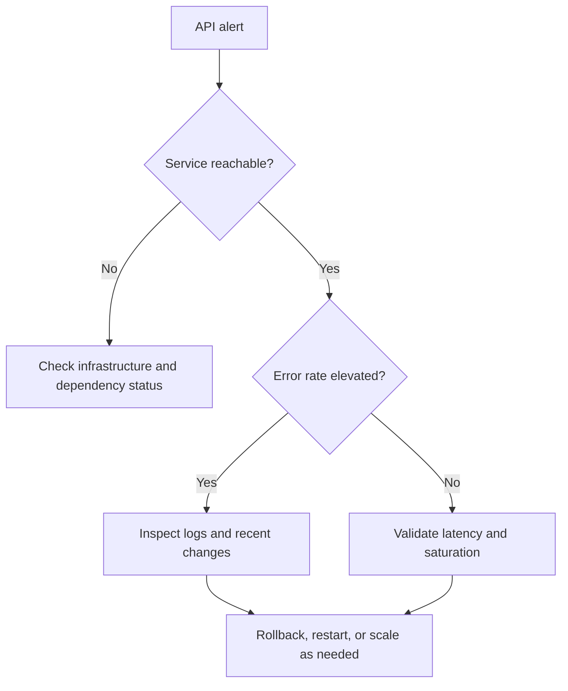

# Runbook: API Outage

## Purpose

Use this runbook when an API serving model outputs or data responses becomes unreachable, errors out, or violates latency expectations. The goal is to quickly determine whether the problem is infrastructure, deployment, dependency, authentication, or traffic saturation.

## Typical Signals

- 5xx error rate spikes.
- Request timeouts increase.
- Latency breaches the SLO.
- The service becomes partially or fully unavailable.

## Immediate Actions

- Confirm the outage is real.
- Check the most recent deploy.
- Review dependency health.
- Inspect logs and saturation metrics.
- Communicate current status to stakeholders.

## Diagnostic Checklist

- Is the service reachable at all?
- Did the latest deployment introduce the issue?
- Is a dependency failing?
- Are auth or rate limits involved?
- Is the service under unexpected load?

## Mermaid Flowchart

## Mitigation Steps

- Roll back the last deployment if needed.
- Restart or scale the affected service.
- Switch to a fallback mode if available.
- Send a concise stakeholder update.

## Validation Steps

- Confirm the API meets the SLO again.
- Check error rate and latency after recovery.
- Verify dependent services are functioning.
- Document the full outage timeline.

## Closure Criteria

- The service is stable.
- Impact is documented.
- Follow-up actions are assigned.
