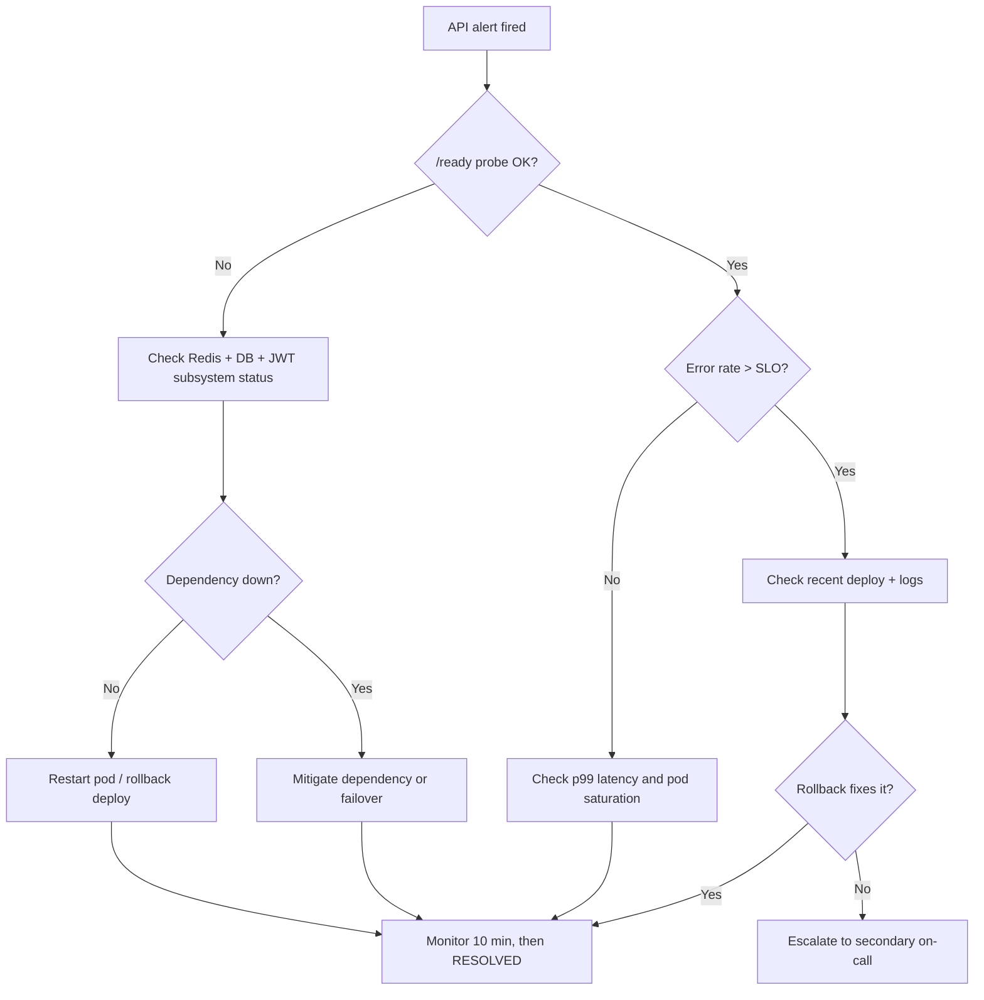

# Runbook: API Outage

**Last reviewed:** 2026-05-24  |  **Lifecycle stage:** OPEN → INVESTIGATING → MITIGATING → RESOLVED → CLOSED

## Purpose

Use this runbook when an API serving model outputs or data responses becomes unreachable,
errors out, or violates latency expectations. The goal is to quickly determine whether
the problem is infrastructure, deployment, dependency, authentication, or traffic saturation.

## SLO Thresholds

| Signal | Warning | SEV-2 | SEV-1 |
|---|---|---|---|
| Error rate (5xx) | > 1% | > 5% for 5 min | > 10% for 2 min |
| p99 latency | > 1 s | > 3 s for 5 min | > 5 s for 2 min |
| `/ready` probe | degraded | failing 2+ checks | failing all checks |
| Availability | < 99.9% (1 min) | < 99.5% (5 min) | < 99% (2 min) |

## Typical Signals

- 5xx error rate spikes above threshold.
- Request timeouts increase; p99 breaches SLO.
- `/ready` returns 503 or partial degraded status.
- The service becomes partially or fully unreachable.

## Immediate Actions (first 5 minutes)

1. Confirm the outage is real — not a monitoring glitch:
   ```bash
   curl -sf https://<API_HOST>/ready | jq .
   curl -sf https://<API_HOST>/health | jq .
   ```
2. Check the most recent deployment:
   ```bash
   kubectl rollout history deployment/ml-incident-api -n production
   git log --oneline -5   # or check CI/CD pipeline for last deploy SHA
   ```
3. Review live error rate and latency (Grafana / OTel dashboard).
4. Open the incident in the API and set status to INVESTIGATING:
   ```bash
   curl -X PATCH https://<API_HOST>/incidents/<ID>/status \
     -H "Authorization: Bearer $TOKEN" \
     -H "Content-Type: application/json" \
     -d '{"status": "investigating"}'
   ```
5. Post a brief status update to the incident channel.

## Escalation Path

| Elapsed | Action |
|---|---|
| 0–15 min | On-call primary works the runbook |
| 15 min | Page on-call secondary if not mitigating |
| 30 min | Page engineering manager |
| 45 min (SEV-1) | Stakeholder / executive notification |

## Diagnostic Checklist

- [ ] Is the service reachable? (`/health`, `/ready`)
- [ ] Did a deployment or config change precede the alert?
- [ ] Is Redis reachable? (`redis-cli -u $REDIS_URL ping`)
- [ ] Is the database reachable? (`psql $DATABASE_URL -c 'SELECT 1;'`)
- [ ] Are auth or rate limits involved? (check `429` rate in logs)
- [ ] Is the service under unexpected load? (check pod CPU/memory)
- [ ] Are JWT tokens expiring correctly? (`GET /ready` checks `jwt_subsystem`)

## Mermaid Flowchart



## Mitigation Steps

```bash
# Option A: Roll back last deployment
kubectl rollout undo deployment/ml-incident-api -n production
kubectl rollout status deployment/ml-incident-api -n production

# Option B: Restart pods without rollback
kubectl rollout restart deployment/ml-incident-api -n production

# Option C: Scale up if under load
kubectl scale deployment/ml-incident-api --replicas=6 -n production

# Option D: Flush Redis denylist if JWT loop suspected
redis-cli -u $REDIS_URL FLUSHDB   # CAUTION: logs all active users out
```

Set status to MITIGATING once action is in progress:
```bash
curl -X PATCH https://<API_HOST>/incidents/<ID>/status \
  -H "Authorization: Bearer $TOKEN" \
  -H "Content-Type: application/json" \
  -d '{"status": "mitigating"}'
```

## Validation Steps

```bash
# Confirm /ready returns 200 with all checks passing
curl -sf https://<API_HOST>/ready | jq '.checks'

# Confirm error rate has returned below SLO threshold
# (Check Grafana dashboard or run a quick smoke test)
curl -sf https://<API_HOST>/health | jq .
```

- Error rate below 1% for at least 5 consecutive minutes.
- p99 latency below 1 s.
- All `/ready` checks returning `ok`.
- No new error patterns in structured logs.

## Closure Criteria

- [ ] Service stable for ≥ 10 minutes post-mitigation.
- [ ] Impact window and affected users documented.
- [ ] Root cause identified (or bounded with a follow-up ticket).
- [ ] Incident status set to RESOLVED then CLOSED via API.
- [ ] PIR scheduled if SEV-1, or SEV-2 lasting > 30 min.

## Post-Incident Review Triggers

- **Required PIR:** Any SEV-1; any SEV-2 > 30 min; any data loss; any external SLA breach.
- **Lightweight note:** SEV-2 < 30 min with known root cause; SEV-3 or lower.

## Related Runbooks

- [Pipeline Failure](./pipeline_failure.md) — if a failed pipeline is causing stale data responses
- [Data Quality Incident](./data_quality_incident.md) — if API returns corrupt or unexpected outputs
- [Model Degradation](./model_degradation.md) — if the API is up but prediction quality is wrong
