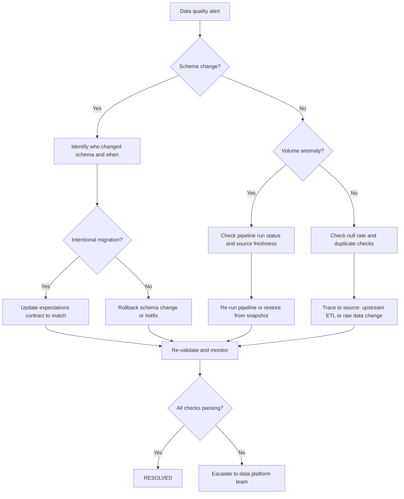

# Runbook: Data Quality Incident

**Last reviewed:** 2026-05-24  |  **Lifecycle stage:** OPEN → INVESTIGATING → MITIGATING → RESOLVED → CLOSED

## Purpose

Use this runbook when data quality checks fail, schemas drift unexpectedly, null rates
spike, or row volumes deviate from expected ranges. These issues can silently corrupt
model inputs, degrade predictions, or cause downstream pipeline failures before any
application-level alert fires.

## SLO Thresholds

| Signal | Warning | SEV-3 | SEV-2 |
|---|---|---|---|
| Null rate (critical features) | > 0.5% | > 2% | > 10% |
| Schema check failures | 1 field | 2–5 fields | > 5 fields or PK type change |
| Row volume deviation | ±15% vs. 7-day avg | ±30% | ±50% or zero rows |
| Duplicate key rate | > 0.01% | > 0.1% | > 1% |
| Freshness (data age) | > expected cadence | 2× cadence | 4× cadence or SLA breach |

## Typical Signals

- Data quality check (Great Expectations / dbt test / custom validator) fails.
- Schema change alert fires (unexpected column add, drop, or type change).
- Null rate, duplicate rate, or row volume deviates from historical range.
- Model predictions begin degrading without a model change (upstream cause).

## Immediate Actions (first 5 minutes)

1. Identify the failing check and affected dataset:
   ```bash
   # Pull recent data quality check results
   kubectl logs -n production deploy/data-quality-runner --tail=100 | \
     jq 'select(.level == "ERROR" or .level == "WARN")'
   ```
2. Check whether a schema migration or upstream ETL change was deployed:
   ```bash
   git log --oneline --since='24 hours ago' -- dbt/ great_expectations/ pipelines/
   ```
3. Assess blast radius — which models and features consume this dataset?
4. Open the incident and set status to INVESTIGATING:
   ```bash
   curl -X PATCH https://<API_HOST>/incidents/<ID>/status \
     -H "Authorization: Bearer $TOKEN" \
     -H "Content-Type: application/json" \
     -d '{"status": "investigating"}'
   ```
5. Notify the data owner and affected model teams.

## Escalation Path

| Elapsed | Action |
|---|---|
| 0–15 min | On-call primary + data owner investigate |
| 15 min | Page on-call secondary if blast radius is expanding |
| 30 min | Page engineering manager |
| 45 min | If data corruption confirmed, page data platform lead |

## Diagnostic Checklist

- [ ] Which specific check(s) failed and on which column(s)?
- [ ] Did an upstream schema change or ETL job change precede the alert?
- [ ] Is the issue limited to one table / dataset, or is it systemic?
- [ ] Did row count drop to zero (pipeline stopped) or change gradually (drift)?
- [ ] Are foreign key or join integrity checks passing?
- [ ] Is the data warehouse / lake reachable and returning expected row counts?
- [ ] Which downstream models and features consume the affected dataset?

## Mermaid Flowchart



## Mitigation Steps

```bash
# Option A: Halt the affected pipeline to stop corrupt data propagating
airflow dags pause <DAG_ID>           # Airflow
prefect deployment pause <DEPLOY_ID>  # Prefect

# Option B: Roll back a schema migration
alembic downgrade -1   # if this project owns the schema
# or contact the upstream team to revert their migration

# Option C: Restore from last known good snapshot
# (procedure depends on warehouse; example for BigQuery)
bq cp <PROJECT>:<DATASET>.<TABLE>@<UNIX_TIMESTAMP_MS> \
     <PROJECT>:<DATASET>.<TABLE>

# Option D: Re-run data quality checks after fix
dbt test --select <MODEL_NAME>
# or
great_expectations checkpoint run <CHECKPOINT_NAME>
```

Set status to MITIGATING once action is in progress:
```bash
curl -X PATCH https://<API_HOST>/incidents/<ID>/status \
  -H "Authorization: Bearer $TOKEN" \
  -H "Content-Type: application/json" \
  -d '{"status": "mitigating"}'
```

## Validation Steps

- All data quality checks passing cleanly (zero failures).
- Row counts within expected range for ≥ 2 consecutive pipeline runs.
- Null rates and schema checks green.
- Downstream model teams confirm prediction quality unaffected (or recovering).

```bash
# Confirm checks pass
dbt test --select <MODEL_NAME>
```

## Closure Criteria

- [ ] All data quality checks passing for ≥ 2 consecutive runs.
- [ ] Blast radius fully documented (which models were affected and for how long).
- [ ] Root cause identified: schema change, ETL bug, upstream source issue.
- [ ] Data contract or expectation suite updated if schema legitimately changed.
- [ ] Incident status set to RESOLVED then CLOSED via API.
- [ ] PIR scheduled per trigger criteria.

## Post-Incident Review Triggers

- **Required PIR:** Any data corruption reaching production; null rate > 10% on a critical feature; external SLA breach; blast radius > 2 models.
- **Lightweight note:** Single-table schema drift caught before model impact; known upstream change with no downstream effect.

## Related Runbooks

- [Pipeline Failure](./pipeline_failure.md) — if a pipeline stoppage is causing the data gap
- [Model Degradation](./model_degradation.md) — if data quality issues are already affecting prediction quality
- [API Outage](./api_outage.md) — if corrupt data is causing the API to return errors
