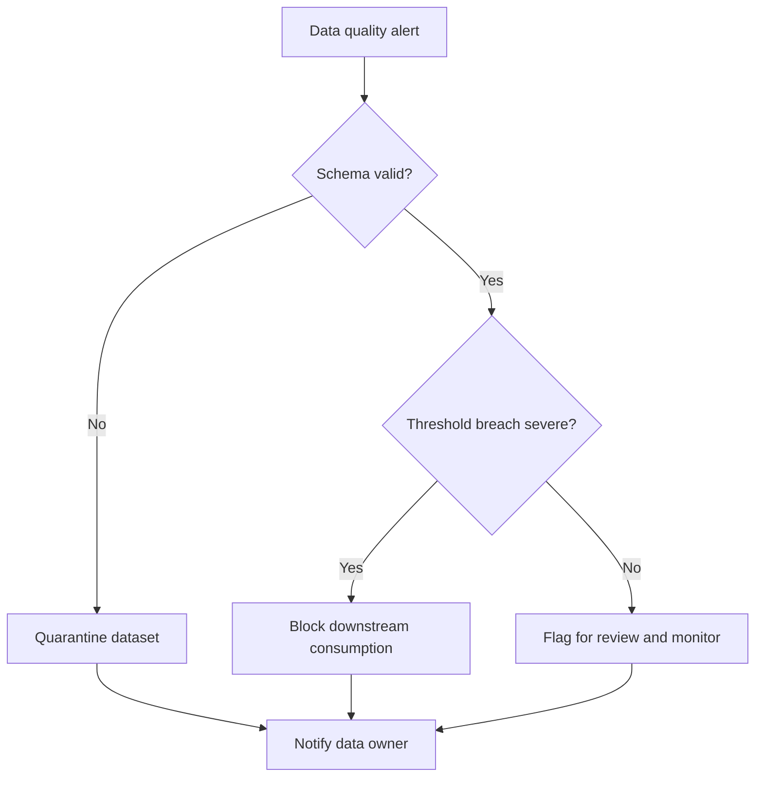

# Runbook: Data Quality Incident

## Purpose

Use this runbook when a dataset is technically delivered but fails quality expectations. This includes null spikes, duplicate spikes, invalid values, freshness gaps, or schema violations that may not break the pipeline immediately but still create production risk.

## Typical Signals

- Null rate spikes above threshold.
- Duplicate records increase unexpectedly.
- Required fields are missing.
- Freshness breaches occur.
- Outlier values appear in core features.

## Immediate Actions

- Identify the affected dataset and field.
- Compare current values against baseline behavior.
- Validate the schema and required constraints.
- Quarantine the dataset if the issue is material.
- Alert the data owner and downstream consumers.

## Diagnostic Checklist

- Is the schema still compatible?
- Is the issue isolated or systemic?
- Did ingestion or transformation logic change?
- Is the upstream source returning bad records?
- Is the anomaly recurring or one-off?

## Mermaid Flowchart

## Mitigation Steps

- Quarantine the impacted data.
- Prevent contaminated records from propagating.
- Reprocess using a known-good source if possible.
- Escalate if the issue affects model inputs or reporting.

## Validation Steps

- Confirm the dataset passes quality checks.
- Revalidate downstream outputs.
- Confirm no new anomalies appear after remediation.
- Add preventive checks if the issue is repeatable.

## Closure Criteria

- Data passes validation thresholds.
- Downstream systems are safe to resume.
- Preventive controls are recorded.
