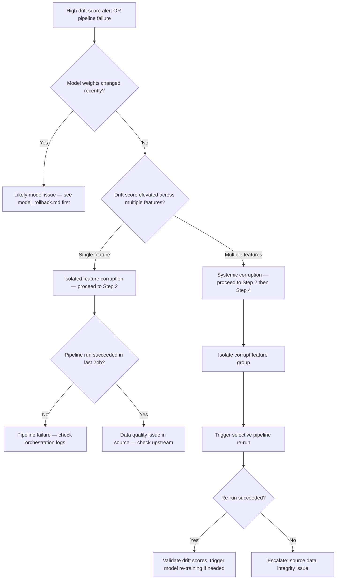

# Feature Store Corruption Runbook

## Metadata

| Field | Value |
|---|---|
| Severity | P1 (training pipeline blocked) / P2 (stale features serving) |
| MTTR Target | 2h (P1) / 8h (P2) |
| On-call Owner | Data Engineering / ML Platform |
| Last Tested | 2026-05-28 — local docker-compose (see `runbook_test_log.md`) |
| Related Alerts | `MLDriftScoreHigh`, `MLFeatureStalenessHigh`, `MLPipelineFailure` |
| Related Metrics | `ml_drift_score_latest`, `ml_active_incidents`, `ml_incident_total` |

---

## Overview

This runbook covers detection, isolation, and recovery from feature store
corruption events. Corruption manifests as: unexpectedly high drift scores
despite stable model weights, training pipeline failures citing schema
mismatches, or downstream model re-training producing degraded metrics.

Do not attempt model rollback before completing Step 1 — rolling back the
model does not resolve corrupted upstream features and will mask the root cause.

---

## Decision Tree



---

## Step 1 — Confirm Feature Store Corruption

Distinguish feature corruption from model weight drift before taking action.

```bash
# Check drift scores across all tracked features
curl -s "http://localhost:9090/api/v1/query" \
  --data-urlencode 'query=ml_drift_score_latest' \
  | jq '[.data.result[] | {feature: .metric.feature_name, psi: .value[1]}] | sort_by(.psi) | reverse'

# If multiple features show PSI > 0.2, check when the spike started
curl -s "http://localhost:9090/api/v1/query_range" \
  --data-urlencode 'query=ml_drift_score_latest' \
  --data-urlencode 'start=now-6h' \
  --data-urlencode 'end=now' \
  --data-urlencode 'step=5m' \
  | jq '[.data.result[] | {feature: .metric.feature_name, values: .values[-3:]}]'

# Check active incident count - systemic corruption shows multiple simultaneous incidents
curl -s "http://localhost:9090/api/v1/query" \
  --data-urlencode 'query=sum(ml_active_incidents)' \
  | jq '.data.result[0].value[1]'

# Check API health - feature store issues should not affect API health
curl -sf http://localhost:8080/health | jq '.checks'
```

**Corruption confirmed when:** 2+ features show PSI > 0.2 with spike onset
correlating to a pipeline run timestamp, and model weights have not changed.

---

## Step 2 — Isolate the Corrupt Feature Group

```bash
# List recent pipeline runs and their status
curl -sf \
  -H "Authorization: Bearer $ADMIN_TOKEN" \
  "http://localhost:8080/api/v1/pipelines/runs?limit=10" \
  | jq '[.[] | {run_id: .run_id, status: .status, started_at: .started_at, features_written: .features_written}]'

# Identify which pipeline run produced the corrupt data
# Cross-reference run timestamps with the drift score spike onset from Step 1

# Check schema validation errors from the suspect run
curl -sf \
  -H "Authorization: Bearer $ADMIN_TOKEN" \
  "http://localhost:8080/api/v1/pipelines/runs/<run_id>/errors" \
  | jq '[.[] | {feature: .feature_name, error: .error_type, detail: .detail}]'

# List affected feature groups
curl -sf \
  -H "Authorization: Bearer $ADMIN_TOKEN" \
  "http://localhost:8080/api/v1/features/groups?status=degraded" \
  | jq '[.[] | {group: .group_name, features: .feature_names, last_updated: .last_updated}]'
```

---

## Step 3 — Quarantine and Roll Back Feature Data

```bash
# Mark the corrupt feature group as quarantined (stops serving to inference)
curl -sf -X POST \
  -H "Authorization: Bearer $ADMIN_TOKEN" \
  -H "Content-Type: application/json" \
  -d '{"status": "quarantined", "reason": "PSI > 0.2 across feature group — runbook FC-01"}' \
  "http://localhost:8080/api/v1/features/groups/<group_name>/status" \
  | jq '.'

# Roll feature store back to last known good snapshot
curl -sf -X POST \
  -H "Authorization: Bearer $ADMIN_TOKEN" \
  -H "Content-Type: application/json" \
  -d '{"target_snapshot": "<snapshot_id>", "feature_group": "<group_name>"}' \
  "http://localhost:8080/api/v1/features/restore" \
  | jq '.'

# Confirm rollback succeeded
curl -sf \
  -H "Authorization: Bearer $ADMIN_TOKEN" \
  "http://localhost:8080/api/v1/features/groups/<group_name>" \
  | jq '{status: .status, snapshot: .active_snapshot, last_updated: .last_updated}'
```

---

## Step 4 — Trigger Selective Pipeline Re-run

```bash
# Trigger re-run for the affected feature group only (not full pipeline)
curl -sf -X POST \
  -H "Authorization: Bearer $ADMIN_TOKEN" \
  -H "Content-Type: application/json" \
  -d '{
    "feature_groups": ["<group_name>"],
    "start_date": "<corruption_onset_date>",
    "validate_schema": true,
    "dry_run": false
  }' \
  "http://localhost:8080/api/v1/pipelines/backfill" \
  | jq '{run_id: .run_id, status: .status, estimated_duration_min: .estimated_duration_min}'

# Monitor re-run progress
curl -sf \
  -H "Authorization: Bearer $ADMIN_TOKEN" \
  "http://localhost:8080/api/v1/pipelines/runs/<run_id>" \
  | jq '{status: .status, progress_pct: .progress_pct, features_written: .features_written}'
```

---

## Step 5 — Validate and Trigger Re-training if Needed

After the pipeline re-run completes:

```bash
# Validate drift scores have returned to baseline
curl -s "http://localhost:9090/api/v1/query" \
  --data-urlencode 'query=ml_drift_score_latest' \
  | jq '[.data.result[] | {feature: .metric.feature_name, psi: .value[1]}]'

# If drift is resolved but model performance is still degraded,
# the model may have been trained on corrupt features and needs re-training
curl -sf -X POST \
  -H "Authorization: Bearer $ADMIN_TOKEN" \
  -H "Content-Type: application/json" \
  -d '{"trigger_reason": "feature_store_corruption_recovery", "feature_groups": ["<group_name>"]}' \
  "http://localhost:8080/api/v1/models/retrain" \
  | jq '{job_id: .job_id, status: .status, estimated_duration_min: .estimated_duration_min}'
```

**Recovery confirmed when:** All feature PSI scores < 0.1 sustained for 30
minutes AND inference P99 latency < 500ms AND no new drift alerts firing.

---

## Step 6 — Escalation

| Condition | Action |
|---|---|
| Pipeline re-run fails with schema error | Source data schema changed — escalate to Data Engineering for schema migration |
| Snapshot unavailable or corrupt | Restore from object storage backup (S3/GCS) — contact platform team |
| Drift persists after re-run | Upstream source data is corrupt — freeze pipeline, escalate to Data Engineering |
| Re-training produces worse metrics | Corruption window wider than estimated — extend backfill date range |

---

## Step 7 — Post-Incident

- [ ] Open incident via `POST /api/v1/incidents` with `category: data_quality`, `severity: SEV-1` or `SEV-2`
- [ ] File postmortem within 24h — root cause must identify: pipeline defect, source schema change, or upstream data quality issue
- [ ] Add schema validation gate to pipeline if not present
- [ ] Review snapshot retention policy — ensure at least 7 days of feature snapshots are retained
- [ ] Update drift threshold baselines in `configs/slos.yml` if seasonal patterns explain PSI spike
- [ ] Log this execution in `runbooks/runbook_test_log.md` if this was a drill

---

## Runbook Validation

| Date | Environment | Tester | Outcome | Issues Found |
|---|---|---|---|---|
| 2026-05-28 | local docker-compose | @zrlopez | PASS | Initial draft — decision tree and Step 1 queries verified against live stack |
