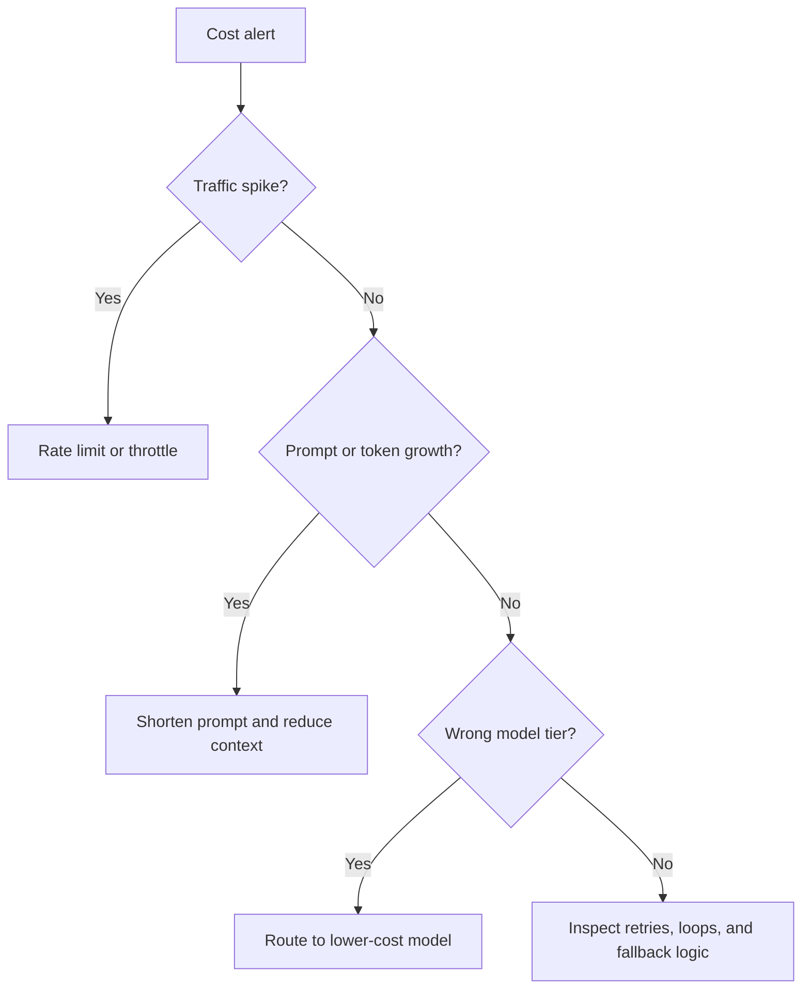

# Runbook: LLM Cost Spike

## Purpose

Use this runbook when LLM usage suddenly becomes expensive or exceeds expected budget. The goal is to isolate whether the cause is traffic growth, prompt inflation, retry loops, model tier mismatch, or a routing bug.

## Typical Signals

- Token usage increases unexpectedly.
- Cost per request rises above target.
- Traffic surges without a known business driver.
- Retry frequency increases.
- The wrong model tier is being used.

## Immediate Actions

- Check the request volume trend.
- Review token usage by endpoint.
- Inspect prompt templates and context size.
- Confirm fallback routing behavior.
- Alert the service owner if the budget is at risk.

## Diagnostic Checklist

- Did traffic spike unusually?
- Did prompt length increase?
- Is the system looping on retries?
- Did a model routing rule change?
- Is the cost alert threshold set correctly?

## Mermaid Flowchart

## Mitigation Steps

- Apply temporary rate limiting if needed.
- Reduce prompt size and context window.
- Use cheaper fallback models where acceptable.
- Set guardrails for usage and budget thresholds.

## Validation Steps

- Confirm cost levels return to target range.
- Verify token counts stabilize.
- Review endpoint-level usage after mitigation.
- Document the cost driver and fix.

## Closure Criteria

- Spend returns to acceptable levels.
- Root cause is identified.
- Guardrails are updated or added.
