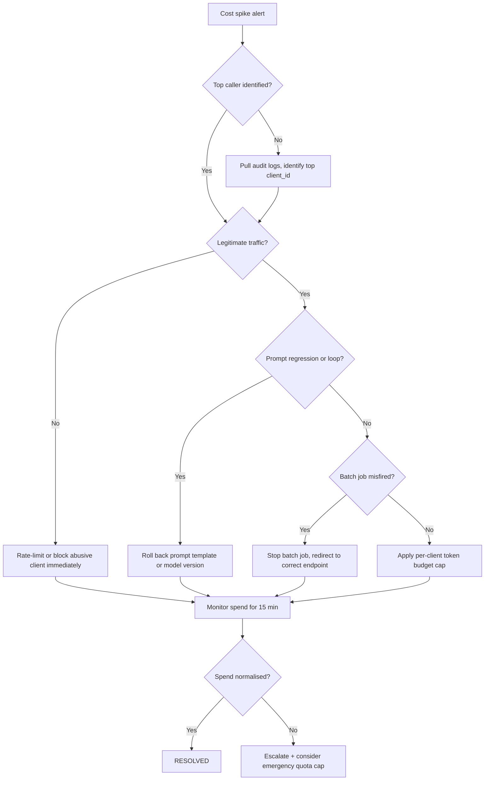

# Runbook: LLM Cost Spike

**Last reviewed:** 2026-05-24  |  **Lifecycle stage:** OPEN → INVESTIGATING → MITIGATING → RESOLVED → CLOSED

## Purpose

Use this runbook when LLM token spend, API call rate, or provider cost metrics deviate
anomalously from expected baselines. Cost spikes can indicate a runaway loop, a prompt
engineering regression, abusive client traffic, or a misconfigured batch job — each
requiring a different mitigation path.

## SLO Thresholds

| Signal | Warning | SEV-3 | SEV-2 |
|---|---|---|---|
| Hourly token spend | > 1.5× 7-day avg | > 2× 7-day avg | > 4× or quota breach risk |
| API call rate (RPM) | > 1.5× baseline | > 2× baseline | > 3× or rate limit hit |
| Avg tokens / request | > 1.3× baseline | > 2× (prompt regression) | > 3× (runaway loop suspected) |
| Provider error rate | > 1% | > 5% | > 10% (quota / throttle) |
| Daily spend forecast | > budget × 1.2 | > budget × 1.5 | > budget × 2 |

## Typical Signals

- Cost anomaly alert fires from cloud billing or LLM provider dashboard.
- Token-per-request metric deviates sharply from baseline (prompt regression or loop).
- Provider rate limit or quota breach imminent or triggered.
- Sudden spike in unique requesting clients (abusive traffic or credential leak).

## Immediate Actions (first 5 minutes)

1. Confirm the spike is real and still active:
   ```bash
   # Pull recent LLM call audit log
   kubectl logs -n production deploy/llm-gateway --tail=200 | \
     jq 'select(.event == "llm.request") | {timestamp, model, tokens_used, client_id}' \
     | tail -20
   ```
2. Identify the top token-consuming callers or request types:
   ```bash
   kubectl logs -n production deploy/llm-gateway --since=30m | \
     jq -r 'select(.event == "llm.request") | .client_id' | \
     sort | uniq -c | sort -rn | head -10
   ```
3. Check provider dashboard for quota status and remaining budget.
4. Open the incident and set status to INVESTIGATING:
   ```bash
   curl -X PATCH https://<API_HOST>/incidents/<ID>/status \
     -H "Authorization: Bearer $TOKEN" \
     -H "Content-Type: application/json" \
     -d '{"status": "investigating"}'
   ```
5. Notify the LLM platform owner and finance / budget owner.

## Escalation Path

| Elapsed | Action |
|---|---|
| 0–15 min | On-call primary + LLM platform owner investigate |
| 15 min | Page on-call secondary if quota breach is imminent |
| 30 min | Page engineering manager |
| 45 min (quota breach or > 2× daily budget forecast) | Finance / budget owner notification |

## Diagnostic Checklist

- [ ] Which endpoint, model, or client_id is responsible for the spike?
- [ ] Did a prompt template or model version change recently?
- [ ] Is there a retry loop or infinite recursion in a chain / agent?
- [ ] Did a new client or integration start calling the LLM gateway unexpectedly?
- [ ] Was a batch job accidentally pointed at the production LLM endpoint?
- [ ] Is the provider returning errors that are causing retries to amplify cost?
- [ ] Has the provider API key or quota been shared or leaked?

## Mermaid Flowchart



## Mitigation Steps

```bash
# Option A: Apply emergency per-client rate limit via SlowAPI or API gateway
# (example: nginx rate limit directive or app-level limiter)
kubectl annotate ingress ml-llm-gateway \
  nginx.ingress.kubernetes.io/limit-rps="10" -n production

# Option B: Disable or pause a runaway batch job
kubectl delete job <RUNAWAY_JOB_NAME> -n production
# or
airflow dags pause <BATCH_DAG_ID>

# Option C: Roll back a prompt template change
git revert <PROMPT_COMMIT_SHA>
git push origin main
# then redeploy or hot-reload the gateway config

# Option D: Emergency hard cap on provider quota
# (Set spend limit in provider dashboard: OpenAI / Anthropic / etc.)
# Note: this may cause 429s for all clients until the window resets.

# Option E: Rotate leaked API key
# 1. Generate new key in provider dashboard
# 2. Update secret in Kubernetes
kubectl create secret generic llm-provider-key \
  --from-literal=api_key=<NEW_KEY> \
  --dry-run=client -o yaml | kubectl apply -f -
# 3. Restart the gateway to pick up new secret
kubectl rollout restart deployment/llm-gateway -n production
```

Set status to MITIGATING once action is in progress:
```bash
curl -X PATCH https://<API_HOST>/incidents/<ID>/status \
  -H "Authorization: Bearer $TOKEN" \
  -H "Content-Type: application/json" \
  -d '{"status": "mitigating"}'
```

## Validation Steps

- Hourly token spend back within 1.5× 7-day average for ≥ 15 consecutive minutes.
- No provider quota breach or rate-limit errors in logs.
- Top token-consuming callers are legitimate and within expected ranges.
- Finance / budget owner confirms spend trajectory is normalised.

```bash
# Spot-check spend rate post-mitigation
kubectl logs -n production deploy/llm-gateway --since=15m | \
  jq 'select(.event == "llm.request") | .tokens_used' | \
  awk '{sum += $1; count++} END {print "avg tokens/req:", sum/count, "total reqs:", count}'
```

## Closure Criteria

- [ ] Token spend normalised for ≥ 15 minutes post-mitigation.
- [ ] Root cause identified: loop, prompt regression, abuse, or batch misfired.
- [ ] Abusive client blocked or rate-limited if applicable.
- [ ] API key rotated if credential leak suspected.
- [ ] Budget forecast updated to reflect any legitimate traffic growth.
- [ ] Incident status set to RESOLVED then CLOSED via API.
- [ ] PIR scheduled per trigger criteria.

## Post-Incident Review Triggers

- **Required PIR:** Quota breach reached provider limit; daily spend > 2× budget; credential leak confirmed.
- **Lightweight note:** Batch job misfired with clean stop; known prompt regression with clean rollback.

## Related Runbooks

- [API Outage](./api_outage.md) — if the LLM gateway itself becomes unreachable due to rate limiting
- [Model Degradation](./model_degradation.md) — if a prompt regression is also degrading output quality
- [Data Quality Incident](./data_quality_incident.md) — if corrupt input data is inflating token usage
