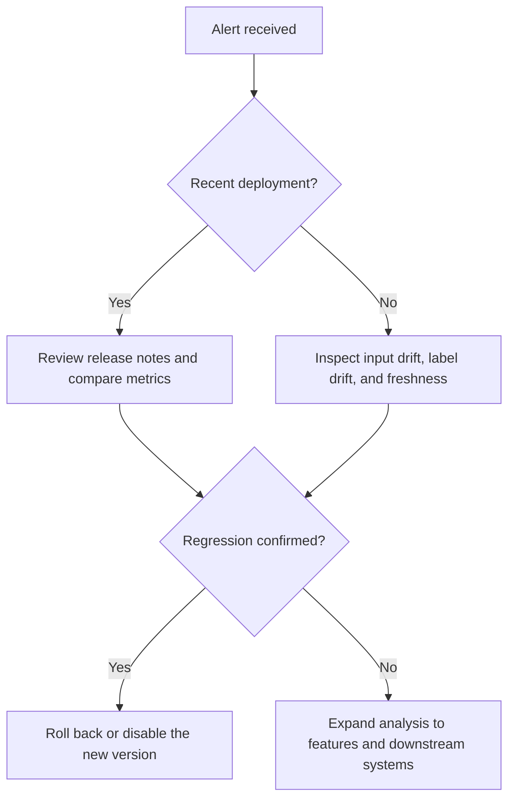

# Runbook: Model Degradation

## Purpose

Use this runbook when a deployed model appears to be underperforming, even though the pipeline is still healthy. The goal is to quickly confirm whether the issue is caused by data drift, label drift, a bad deployment, or a downstream dependency change.

## Typical Signals

- Accuracy, precision, recall, or a business KPI drops below threshold.
- User feedback becomes consistently negative.
- Latency stays stable, but prediction quality degrades.
- Performance differs from the last known stable baseline.

## Immediate Actions

- Confirm the alert is real and not a monitoring glitch.
- Check whether a deployment occurred recently.
- Compare current metrics to the last stable release.
- Review data freshness and feature distributions.
- Notify the model owner and incident owner.

## Diagnostic Checklist

- Was there a model version change?
- Did feature distributions shift?
- Did label quality degrade?
- Did input volume change materially?
- Did a dependency or preprocessing step change?

## Mermaid Flowchart

## Mitigation Steps

- Roll back to the last stable model if available.
- Temporarily disable the affected route or feature flag if needed.
- Freeze suspicious upstream changes until validated.
- Escalate if the issue appears to be data-related or systemic.

## Validation Steps

- Confirm performance returns to baseline.
- Verify no new error patterns appear after rollback.
- Re-check dashboard metrics for stability.
- Log the incident timeline and outcome.

## Closure Criteria

- The model is back within acceptable performance thresholds.
- The root cause is identified or bounded.
- Follow-up prevention tasks are assigned.
