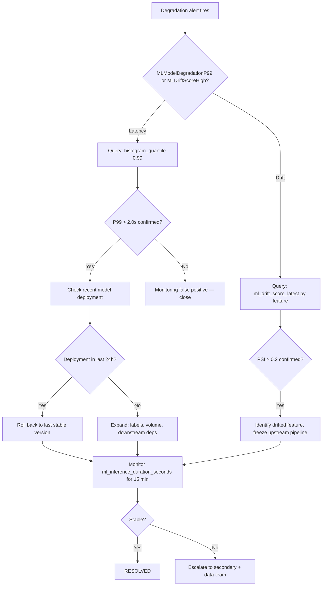

# Runbook: Model Degradation

**Last reviewed:** 2026-05-28  |  **Lifecycle stage:** OPEN → INVESTIGATING → MITIGATING → RESOLVED → CLOSED

## Metadata

| Field | Value |
|---|---|
| Severity | SEV-1 (P99 > 2 s for 5 m) / SEV-2 (P99 > 1 s for 5 m) / SEV-3 (accuracy drop > 5%) |
| MTTR Target | 4 h (SEV-1) / 8 h (SEV-2) / 24 h (SEV-3) |
| On-call Owner | ML Platform |
| Last Tested | 2026-05-28 (local docker-compose drill) |
| Related Alerts | `MLModelDegradationP99`, `MLDriftScoreHigh`, `MLIncidentRateSpike` |

---

## Alert Trigger

This runbook is initiated when **any** of the following Prometheus alerts fire:

| Alert Name | Prometheus Expression | Threshold | Severity |
|---|---|---|---|
| `MLModelDegradationP99` | `histogram_quantile(0.99, rate(ml_inference_duration_seconds_bucket[5m]))` | > 2.0 s for 5 m | SEV-1 |
| `MLModelDegradationP99Warning` | `histogram_quantile(0.99, rate(ml_inference_duration_seconds_bucket[5m]))` | > 1.0 s for 5 m | SEV-2 |
| `MLDriftScoreHigh` | `ml_drift_score_latest{feature_name=~".+"}` | PSI > 0.2 | SEV-2 |
| `MLIncidentRateSpike` | `rate(ml_incident_total[1h])` | > 10/hr | SEV-2 |
| `MLAPICriticalErrorRate` | `rate(http_requests_total{status=~"5.."}[5m]) / rate(http_requests_total[5m])` | > 20% | SEV-1 |

---

## Purpose

Use this runbook when a deployed model appears to be underperforming even though the
pipeline and API are healthy. The goal is to quickly confirm whether the issue is
caused by data drift, label drift, a bad deployment, or a downstream dependency change.

## SLO Thresholds

| Metric | Warning | SEV-3 | SEV-2 |
|---|---|---|---|
| Accuracy / primary KPI | Drops > 2% vs. baseline | Drops > 5% | Drops > 10% |
| Prediction latency (p99) | > 500 ms | > 1 s for 5 min | > 2 s for 5 min |
| Feature null rate | > 0.5% | > 2% | > 5% |
| Input volume | ±20% vs. 7-day avg | ±40% | ±60% |

## Typical Signals

- Accuracy, precision, recall, or a business KPI drops below threshold.
- User feedback becomes consistently negative.
- Latency stays stable but prediction quality degrades.
- Performance differs measurably from the last known stable baseline.

## Immediate Actions (first 5 minutes)

1. Confirm the alert is real — query Prometheus directly:
   ```bash
   # Current P99 inference latency (MLModelDegradationP99 fires if > 2.0s)
   curl -s http://localhost:9090/api/v1/query \
     --data-urlencode 'query=histogram_quantile(0.99, rate(ml_inference_duration_seconds_bucket[5m]))' \
     | jq '.data.result[] | {metric: .metric, value: .value[1]}'

   # Current feature drift score (MLDriftScoreHigh fires if PSI > 0.2)
   curl -s http://localhost:9090/api/v1/query \
     --data-urlencode 'query=ml_drift_score_latest' \
     | jq '.data.result[] | {feature: .metric.feature_name, psi: .value[1]}'

   # Incident creation rate over 1h (MLIncidentRateSpike fires if > 10/hr)
   curl -s http://localhost:9090/api/v1/query \
     --data-urlencode 'query=rate(ml_incident_total[1h])' \
     | jq '.data.result'
   ```
2. Check whether a model deployment occurred recently:
   ```bash
   kubectl rollout history deployment/ml-model-server -n production
   # or query your model registry for the last promotion timestamp
   ```
3. Compare current metrics to the last stable baseline in the Grafana dashboard:
   `http://localhost:3000/d/ml-ops-overview` (ML Operations Overview)
4. Open the incident and set status to INVESTIGATING:
   ```bash
   curl -X PATCH https://<API_HOST>/incidents/<ID>/status \
     -H "Authorization: Bearer $TOKEN" \
     -H "Content-Type: application/json" \
     -d '{"status": "investigating"}'
   ```
5. Notify the model owner and incident commander.

## Escalation Path

| Elapsed | Action |
|---|---|
| 0–15 min | On-call primary + model owner investigate |
| 15 min | Page on-call secondary if no root cause |
| 30 min | Page engineering manager |
| 60 min (SEV-2) | Stakeholder notification; consider rollback |

## Diagnostic Checklist

- [ ] Was there a model version or config change in the last 24 h?
- [ ] Did input feature distributions shift? (check `ml_drift_score_latest` in Grafana)
- [ ] Did label quality or ground-truth pipeline change?
- [ ] Did input request volume change materially (> 40%)? (check `rate(ml_incident_total[1h])`)
- [ ] Did a preprocessing or feature-engineering step change?
- [ ] Is the model server returning errors silently? (check prediction error logs)
- [ ] Is the issue limited to one model version, region, or cohort?

## Mermaid Flowchart



## Mitigation Steps

```bash
# Option A: Roll back model server to last stable version
kubectl rollout undo deployment/ml-model-server -n production
kubectl rollout status deployment/ml-model-server -n production

# Option B: Toggle feature flag / disable affected route
curl -X POST https://<API_HOST>/admin/feature-flags/model-v2 \
  -H "Authorization: Bearer $ADMIN_TOKEN" \
  -d '{"enabled": false}'

# Option C: Freeze upstream feature pipeline if data-driven
airflow dags pause <DAG_ID>
```

Set status to MITIGATING once action is in progress:
```bash
curl -X PATCH https://<API_HOST>/incidents/<ID>/status \
  -H "Authorization: Bearer $TOKEN" \
  -H "Content-Type: application/json" \
  -d '{"status": "mitigating"}'
```

## Validation Steps

- P99 latency (`ml_inference_duration_seconds`) returns below 500 ms for ≥ 15 consecutive minutes.
- `ml_drift_score_latest` drops below PSI 0.1 for all features.
- Feature null rate back below 0.5%.
- No new error patterns in prediction audit logs.
- Model owner confirms metrics are stable in Grafana (`ml-ops-overview` dashboard).

```bash
# Spot-check P99 latency post-mitigation (should be < 0.5)
curl -s http://localhost:9090/api/v1/query \
  --data-urlencode 'query=histogram_quantile(0.99, rate(ml_inference_duration_seconds_bucket[5m]))' \
  | jq '.data.result[] | .value[1]'
```

## Closure Criteria

- [ ] P99 latency stable below 500 ms for ≥ 15 minutes post-mitigation.
- [ ] Root cause identified or bounded.
- [ ] Model version, drift source, or config change documented.
- [ ] Incident status set to RESOLVED then CLOSED via API.
- [ ] Retraining or data correction ticket created if drift confirmed.
- [ ] PIR scheduled per trigger criteria.

## Post-Incident Review Triggers

- **Required PIR:** KPI dropped > 10% (SEV-2); root cause unknown at closure; data corruption confirmed.
- **Lightweight note:** Isolated version regression with clean rollback and known root cause.

## Drift Detection — Implementation Reference

> This section ties the runbook to the **actually implemented** drift and
> anomaly detection code in this repository. Steps here can be run locally
> without Kubernetes or Prometheus.

### 1. Check the active anomaly threshold

The threshold used by `ModelRegistry.predict()` is configurable via the
`ANOMALY_THRESHOLD` env var (default `0.0`) and is exposed at the health
endpoint:

```bash
curl -s http://localhost:8000/api/v1/inference/anomaly/health \
  -H "Authorization: Bearer $TOKEN" \
  | jq '{model_version, artifact_exists, anomaly_threshold}'
# Expected output includes "anomaly_threshold": 0.0 (or your override value)
```

To tighten sensitivity (reduce false positives) during an incident:

```bash
# Lower threshold = harder to flag as anomalous = fewer false positives
export ANOMALY_THRESHOLD=-0.05
# Restart the API worker; new value reflected immediately at /health
```

### 2. Run drift detection manually

`observability/drift_check.py` exposes `check_drift_suite()` which computes
PSI + JS-divergence per feature against a reference distribution:

```python
from observability.drift_check import check_drift_suite
import numpy as np

# Replace with arrays from your DB score log or recent inference batch
reference = np.random.normal(0, 1, 500)   # baseline score distribution
current   = np.random.normal(0.3, 1, 200) # recent window

result = check_drift_suite(
    reference_scores=reference,
    current_scores=current,
    feature_name="anomaly_score",
    psi_threshold=0.2,
    js_threshold=0.1,
)
print(result)  # {"drifted": bool, "psi": float, "js_divergence": float, ...}
```

PSI interpretation:

| PSI Range | Signal |
|---|---|
| < 0.1 | No significant drift |
| 0.1 – 0.2 | Moderate drift — monitor closely |
| > 0.2 | Significant drift — investigate and consider retraining |

### 3. Retrain the model

If drift is confirmed or threshold tuning alone is insufficient:

```bash
# Regenerate synthetic training data + artifact + SHA-256 checksum
python scripts/train_model.py --n-samples 2000 --contamination 0.05 --verbose

# Confirm new checksum was written alongside the artifact
ls -la ml_models/incident_anomaly/artifacts/
# isolation_forest_v1.joblib
# isolation_forest_v1.joblib.sha256   <-- generated automatically
# model_metadata.json                 <-- includes artifact_sha256 field

# Restart the API so ModelRegistry reloads the new artifact
```

---

## Runbook Validation

| Date | Tester | Environment | Outcome | Notes |
|---|---|---|---|---|
| 2026-05-28 | @zrlopez | local docker-compose | PASS | Alert trigger table and Prometheus curl commands validated |
| 2026-08-05 | @zrlopez | local docker-compose | PASS | Drift detection section validated; `ANOMALY_THRESHOLD` env-var override confirmed; `check_drift_suite()` ran against synthetic distributions |

## Related Runbooks

- [Data Quality Incident](./data_quality_incident.md) — if feature drift or corrupt inputs caused the degradation
- [Pipeline Failure](./pipeline_failure.md) — if a stale feature store is driving the issue
- [API Outage](./api_outage.md) — if prediction errors are actually serving errors
