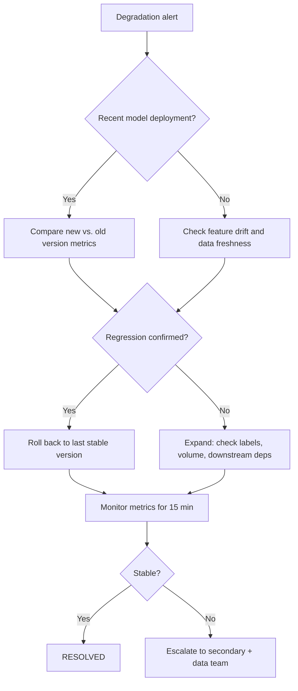

# Runbook: Model Degradation

**Last reviewed:** 2026-05-24  |  **Lifecycle stage:** OPEN → INVESTIGATING → MITIGATING → RESOLVED → CLOSED

## Purpose

Use this runbook when a deployed model appears to be underperforming even though the
pipeline and API are healthy. The goal is to quickly confirm whether the issue is
caused by data drift, label drift, a bad deployment, or a downstream dependency change.

## SLO Thresholds

| Metric | Warning | SEV-3 | SEV-2 |
|---|---|---|---|
| Accuracy / primary KPI | Drops > 2% vs. baseline | Drops > 5% | Drops > 10% |
| Prediction latency (p99) | > 500 ms | > 1 s for 5 min | > 2 s for 5 min |
| Feature null rate | > 0.5% | > 2% | > 5% |
| Input volume | ±20% vs. 7-day avg | ±40% | ±60% |

## Typical Signals

- Accuracy, precision, recall, or a business KPI drops below threshold.
- User feedback becomes consistently negative.
- Latency stays stable but prediction quality degrades.
- Performance differs measurably from the last known stable baseline.

## Immediate Actions (first 5 minutes)

1. Confirm the alert is real — not a monitoring glitch or A/B shadow traffic:
   ```bash
   # Pull the last 100 prediction audit log lines
   kubectl logs -n production deploy/ml-incident-api --tail=100 | \
     jq 'select(.event == "prediction.served")' | head -20
   ```
2. Check whether a model deployment occurred recently:
   ```bash
   kubectl rollout history deployment/ml-model-server -n production
   # or query your model registry for the last promotion timestamp
   ```
3. Compare current metrics to the last stable baseline in your metrics dashboard.
4. Open the incident and set status to INVESTIGATING:
   ```bash
   curl -X PATCH https://<API_HOST>/incidents/<ID>/status \
     -H "Authorization: Bearer $TOKEN" \
     -H "Content-Type: application/json" \
     -d '{"status": "investigating"}'
   ```
5. Notify the model owner and incident commander.

## Escalation Path

| Elapsed | Action |
|---|---|
| 0–15 min | On-call primary + model owner investigate |
| 15 min | Page on-call secondary if no root cause |
| 30 min | Page engineering manager |
| 60 min (SEV-2) | Stakeholder notification; consider rollback |

## Diagnostic Checklist

- [ ] Was there a model version or config change in the last 24 h?
- [ ] Did input feature distributions shift? (check feature store freshness)
- [ ] Did label quality or ground-truth pipeline change?
- [ ] Did input request volume change materially (> 40%)?
- [ ] Did a preprocessing or feature-engineering step change?
- [ ] Is the model server returning errors silently? (check prediction error logs)
- [ ] Is the issue limited to one model version, region, or cohort?

## Mermaid Flowchart



## Mitigation Steps

```bash
# Option A: Roll back model server to last stable version
kubectl rollout undo deployment/ml-model-server -n production
kubectl rollout status deployment/ml-model-server -n production

# Option B: Toggle feature flag / disable affected route
curl -X POST https://<API_HOST>/admin/feature-flags/model-v2 \
  -H "Authorization: Bearer $ADMIN_TOKEN" \
  -d '{"enabled": false}'

# Option C: Freeze upstream feature pipeline if data-driven
# (Halt the relevant Airflow DAG or Prefect flow)
airflow dags pause <DAG_ID>
```

Set status to MITIGATING once action is in progress:
```bash
curl -X PATCH https://<API_HOST>/incidents/<ID>/status \
  -H "Authorization: Bearer $TOKEN" \
  -H "Content-Type: application/json" \
  -d '{"status": "mitigating"}'
```

## Validation Steps

- Primary KPI returns to within 2% of baseline for ≥ 15 consecutive minutes.
- Feature null rate back below 0.5%.
- No new error patterns in prediction audit logs.
- Model owner confirms metrics are stable.

```bash
# Spot-check prediction logs post-mitigation
kubectl logs -n production deploy/ml-model-server --tail=50 | \
  jq 'select(.event == "prediction.served") | {model_version, latency_ms, error}'
```

## Closure Criteria

- [ ] Model KPI stable for ≥ 15 minutes post-mitigation.
- [ ] Root cause identified or bounded.
- [ ] Model version, drift source, or config change documented.
- [ ] Incident status set to RESOLVED then CLOSED via API.
- [ ] Retraining or data correction ticket created if drift confirmed.
- [ ] PIR scheduled per trigger criteria.

## Post-Incident Review Triggers

- **Required PIR:** KPI dropped > 10% (SEV-2); root cause unknown at closure; data corruption confirmed.
- **Lightweight note:** Isolated version regression with clean rollback and known root cause.

## Related Runbooks

- [Data Quality Incident](./data_quality_incident.md) — if feature drift or corrupt inputs caused the degradation
- [Pipeline Failure](./pipeline_failure.md) — if a stale feature store is driving the issue
- [API Outage](./api_outage.md) — if prediction errors are actually serving errors
