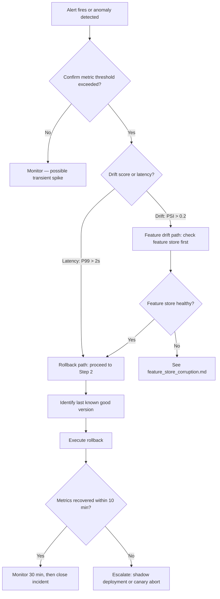

# Model Rollback Runbook

## Metadata

| Field | Value |
|---|---|
| Severity | P1 (production model failure) / P2 (degraded performance) |
| MTTR Target | 30 min (P1) / 2h (P2) |
| On-call Owner | ML Platform |
| Last Tested | 2026-05-28 — local docker-compose (see `runbook_test_log.md`) |
| Related Alerts | `MLModelDegradationP99`, `MLDriftScoreHigh`, `MLIncidentRateSpike` |
| Related Metrics | `ml_inference_duration_seconds`, `ml_drift_score_latest`, `ml_active_incidents` |

---

## Overview

This runbook covers rolling back a degraded or failing model to the last known
good version. It applies when inference latency spikes, drift score exceeds
threshold, or error rate indicates the active model is producing unreliable
output. It does not cover feature store corruption (see
`feature_store_corruption.md`) or full API outages (see `api_outage.md`).

---

## Decision Tree



---

## Step 1 — Confirm the Incident

Verify the alert is real, not a transient spike, before taking action.

```bash
# Check current P99 inference latency (threshold: > 2.0s for 5+ min = rollback)
curl -s "http://localhost:9090/api/v1/query" \
  --data-urlencode 'query=histogram_quantile(0.99, rate(ml_inference_duration_seconds_bucket[5m]))' \
  | jq '.data.result[0].value[1]'

# Check drift score (threshold: PSI > 0.2 = investigate feature store)
curl -s "http://localhost:9090/api/v1/query" \
  --data-urlencode 'query=ml_drift_score_latest' \
  | jq '.data.result[] | {feature: .metric.feature_name, score: .value[1]}'

# Check active incident count by severity
curl -s "http://localhost:9090/api/v1/query" \
  --data-urlencode 'query=ml_active_incidents' \
  | jq '.data.result[] | {severity: .metric.severity, count: .value[1]}'

# Verify API health
curl -sf http://localhost:8080/health | jq '.'
```

**Rollback trigger criteria (any one sufficient):**

| Metric | Expression | Threshold | Duration |
|---|---|---|---|
| P99 latency | `histogram_quantile(0.99, rate(ml_inference_duration_seconds_bucket[5m]))` | > 2.0s | 5 consecutive minutes |
| Drift score | `ml_drift_score_latest` | PSI > 0.2 | Any sample |
| Incident rate | `rate(ml_incident_total[1h])` | > 10/hr | 15 consecutive minutes |

---

## Step 2 — Identify Last Known Good Version

```bash
# List all registered model versions with status
curl -sf \
  -H "Authorization: Bearer $ADMIN_TOKEN" \
  http://localhost:8080/api/v1/models \
  | jq '[.[] | {version: .version, status: .status, registered_at: .registered_at, metrics: .metrics}]'

# Filter to only previously active (healthy) versions
curl -sf \
  -H "Authorization: Bearer $ADMIN_TOKEN" \
  http://localhost:8080/api/v1/models \
  | jq '[.[] | select(.status == "inactive" or .status == "healthy") | {version: .version, registered_at: .registered_at}]'
```

Identify the most recent version with status `healthy` or `inactive` that
precedes the current degraded version. Note the `version` value for Step 3.

---

## Step 3 — Execute Rollback

### Option A: Direct Version Activation (preferred)

```bash
# Replace <target_version> with the version identified in Step 2
export TARGET_VERSION="<target_version>"

curl -sf -X POST \
  -H "Authorization: Bearer $ADMIN_TOKEN" \
  -H "Content-Type: application/json" \
  http://localhost:8080/api/v1/models/${TARGET_VERSION}/activate \
  | jq '.'

# Confirm activation
curl -sf \
  -H "Authorization: Bearer $ADMIN_TOKEN" \
  http://localhost:8080/api/v1/models/active \
  | jq '{version: .version, status: .status, activated_at: .activated_at}'
```

### Option B: Canary Abort (if canary deployment is active)

```bash
# Abort the canary and revert 100% traffic to stable
curl -sf -X POST \
  -H "Authorization: Bearer $ADMIN_TOKEN" \
  -H "Content-Type: application/json" \
  -d '{"action": "abort", "reason": "P99 latency threshold exceeded during canary"}' \
  http://localhost:8080/api/v1/deployments/canary/abort \
  | jq '.'
```

### Option C: Shadow Deployment Promotion Abort

If a shadow model was being evaluated and promoted prematurely:

```bash
# Demote shadow to evaluation-only
curl -sf -X POST \
  -H "Authorization: Bearer $ADMIN_TOKEN" \
  -H "Content-Type: application/json" \
  -d '{"mode": "shadow"}' \
  http://localhost:8080/api/v1/deployments/shadow/demote \
  | jq '.'
```

---

## Step 4 — Verify Recovery

Wait 2-3 minutes post-rollback, then confirm metrics are recovering:

```bash
# P99 latency should be falling back below 500ms
curl -s "http://localhost:9090/api/v1/query" \
  --data-urlencode 'query=histogram_quantile(0.99, rate(ml_inference_duration_seconds_bucket[5m]))' \
  | jq '.data.result[0].value[1]'

# Drift score should stabilise
curl -s "http://localhost:9090/api/v1/query" \
  --data-urlencode 'query=ml_drift_score_latest' \
  | jq '.data.result[0].value[1]'

# Confirm active incident count is not still climbing
curl -s "http://localhost:9090/api/v1/query" \
  --data-urlencode 'query=rate(ml_incident_total[15m])' \
  | jq '.data.result[0].value[1]'
```

**Recovery confirmed when:** P99 < 500ms sustained for 10 minutes AND drift
score < 0.1 AND incident rate returning to baseline.

---

## Step 5 — Escalation

Escalate if metrics have not recovered within **30 minutes** of rollback:

| Condition | Action |
|---|---|
| Rollback version also degraded | Prior version may share corrupted feature data — see `feature_store_corruption.md` |
| No healthy prior version available | Disable inference endpoint, serve cached/fallback responses |
| Latency recovered but drift remains high | Feature pipeline issue — escalate to Data Engineering |
| API unresponsive after rollback | See `api_outage.md` |

---

## Step 6 — Post-Incident

- [ ] Open incident via `POST /api/v1/incidents` with `category: model_rollback`, `severity: SEV-1` or `SEV-2`
- [ ] File postmortem within 24h using `docs/templates/postmortem_template.md`
- [ ] Document root cause: data drift, training pipeline defect, or deployment error
- [ ] Update `ml_drift_score_latest` baseline thresholds in `configs/slos.yml` if drift definition requires adjustment
- [ ] Create follow-up issue for permanent fix before re-promoting the rolled-back version
- [ ] Log this execution in `runbooks/runbook_test_log.md` if this was a drill

---

## Runbook Validation

| Date | Environment | Tester | Outcome | Issues Found |
|---|---|---|---|---|
| 2026-05-28 | local docker-compose | @zrlopez | PASS | Initial draft — commands verified against live stack |
