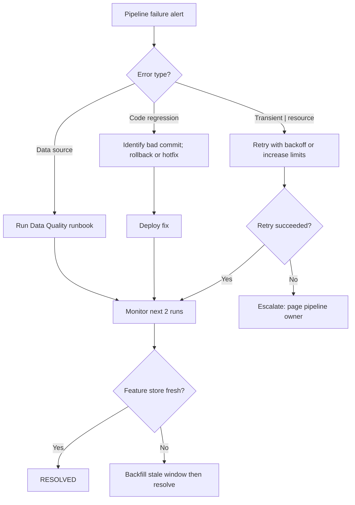

# Runbook: Pipeline Failure

**Last reviewed:** 2026-05-24  |  **Lifecycle stage:** OPEN → INVESTIGATING → MITIGATING → RESOLVED → CLOSED

## Purpose

Use this runbook when a data ingestion, feature engineering, or model training pipeline
fails, stalls, or produces stale output. Unresolved pipeline failures propagate stale
features to the model server and can silently degrade prediction quality before any
model-level alert fires.

## SLO Thresholds

| Signal | Warning | SEV-3 | SEV-2 |
|---|---|---|---|
| Pipeline SLA breach | ≥ 1 missed run | ≥ 2 consecutive missed runs | ≥ 3 or feature store stale |
| Job duration vs. p99 | > 1.5× p99 | > 2× p99 | > 3× p99 or timeout |
| Feature freshness | > 1.1× cadence | > 1.5× cadence | > 2× cadence |
| Retry count | 1 auto-retry | 2 retries | 3 retries (max); job dead |

## Typical Signals

- Airflow / Prefect / Kubeflow DAG enters Failed or Zombie state.
- Job runtime exceeds p99 and triggers a timeout alert.
- Feature store freshness check reports stale data.
- Model predictions degrade without a model version change (upstream stale features).

## Immediate Actions (first 5 minutes)

1. Identify the failed job and last successful run:
   ```bash
   # Airflow
   airflow dags list-runs -d <DAG_ID> --state failed --limit 5
   airflow tasks logs <DAG_ID> <TASK_ID> <EXECUTION_DATE>

   # Prefect
   prefect flow-run ls --state FAILED --limit 5
   ```
2. Check whether a code or config change was deployed to the pipeline:
   ```bash
   git log --oneline --since='24 hours ago' -- pipelines/ dags/ flows/
   ```
3. Assess downstream impact — is the feature store already stale?
4. Open the incident and set status to INVESTIGATING:
   ```bash
   curl -X PATCH https://<API_HOST>/incidents/<ID>/status \
     -H "Authorization: Bearer $TOKEN" \
     -H "Content-Type: application/json" \
     -d '{"status": "investigating"}'
   ```
5. Notify pipeline owner and model teams consuming affected features.

## Escalation Path

| Elapsed | Action |
|---|---|
| 0–15 min | On-call primary investigates |
| 15 min | Page pipeline owner if not responsive |
| 30 min | Page engineering manager |
| 45 min (feature store stale ≥ 2× cadence) | Notify model team leads; consider serving staleness warning |

## Diagnostic Checklist

- [ ] Which task(s) failed and what is the error?
- [ ] Did a code, dependency, or infra change precede the failure?
- [ ] Is the failure transient (network, resource pressure) or deterministic?
- [ ] Are upstream data sources reachable and fresh?
- [ ] Did resource limits (CPU, memory, disk) cause an OOM or timeout?
- [ ] Is the orchestrator itself healthy? (Airflow scheduler, Prefect agent)
- [ ] What is the current feature store freshness for affected features?

## Mermaid Flowchart



## Mitigation Steps

```bash
# Option A: Manually trigger a retry
airflow tasks clear <DAG_ID> -t <TASK_ID> -s <START_DATE> -e <END_DATE> --yes
# or
prefect deployment run <DEPLOYMENT_NAME>

# Option B: Roll back pipeline code to last stable commit
git revert <BAD_COMMIT_SHA>
git push origin main
# then re-trigger the pipeline

# Option C: Increase task resource limits (temporary)
kubectl edit deployment/<PIPELINE_WORKER> -n production
# update resources.limits.memory / cpu

# Option D: Backfill stale feature window after fix
airflow dags backfill <DAG_ID> \
  --start-date <STALE_FROM_DATE> \
  --end-date <NOW_DATE>
```

Set status to MITIGATING once action is in progress:
```bash
curl -X PATCH https://<API_HOST>/incidents/<ID>/status \
  -H "Authorization: Bearer $TOKEN" \
  -H "Content-Type: application/json" \
  -d '{"status": "mitigating"}'
```

## Validation Steps

- Pipeline completes successfully for ≥ 2 consecutive runs.
- Feature store freshness back within expected cadence.
- No new task failures in the last run.
- Model team confirms prediction quality unaffected (or recovering from backfill).

```bash
# Confirm last run succeeded
airflow dags list-runs -d <DAG_ID> --state success --limit 3
```

## Closure Criteria

- [ ] Pipeline running cleanly for ≥ 2 consecutive runs.
- [ ] Feature store freshness confirmed within SLO.
- [ ] Root cause identified: transient error, code regression, upstream source, or infra.
- [ ] Any stale data window fully backfilled.
- [ ] Incident status set to RESOLVED then CLOSED via API.
- [ ] PIR scheduled per trigger criteria.

## Post-Incident Review Triggers

- **Required PIR:** Feature store stale ≥ 2× cadence; model degradation caused by stale features; root cause unknown.
- **Lightweight note:** Transient failure with successful auto-retry and no downstream impact.

## Related Runbooks

- [Data Quality Incident](./data_quality_incident.md) — if a data quality failure caused the pipeline to abort
- [Model Degradation](./model_degradation.md) — if stale features are already degrading predictions
- [API Outage](./api_outage.md) — if the pipeline serves a real-time API and the outage is downstream
