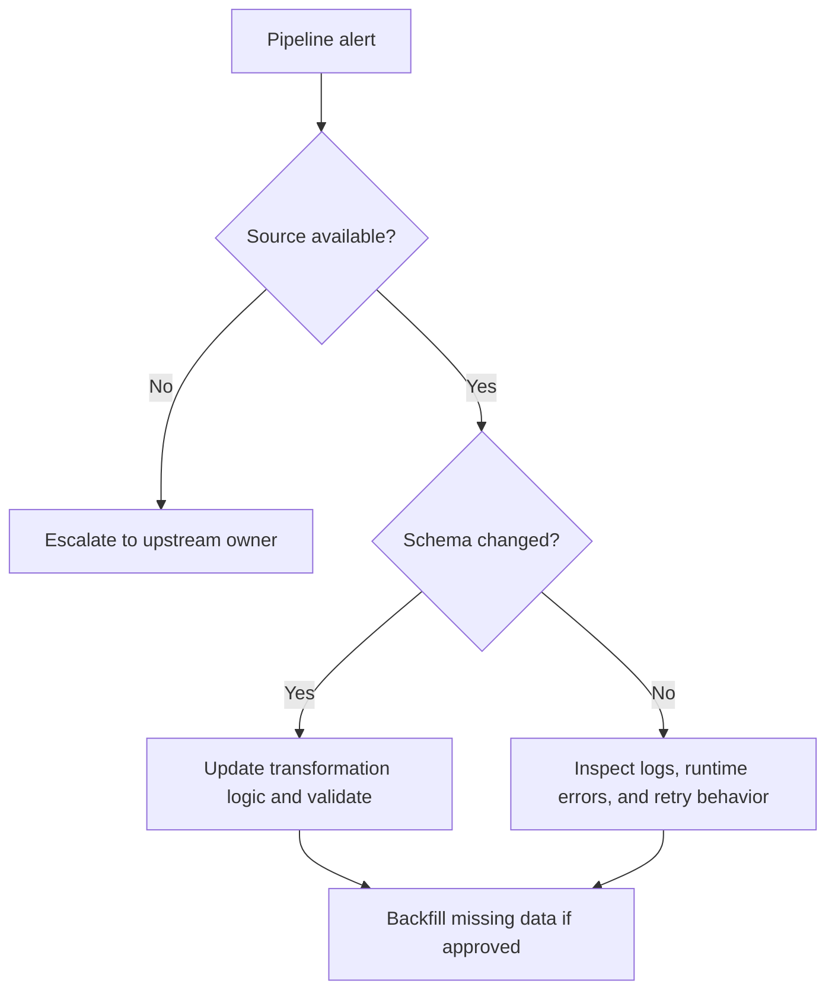

# Runbook: Data Pipeline Failure

## Purpose

Use this runbook when an ETL or orchestration job fails, stalls, or produces incomplete output. The goal is to determine whether the failure is caused by upstream availability, a schema change, a runtime error, or a dependency outage.

## Typical Signals

- Scheduled job fails.
- Output table is missing or incomplete.
- Orchestration delay breaches SLA.
- Downstream consumers report stale data.

## Immediate Actions

- Check the orchestration log and failure message.
- Verify the source system is reachable.
- Check for schema or contract changes.
- Pause downstream jobs if the data is incomplete.
- Notify the pipeline owner.

## Diagnostic Checklist

- Did an upstream source fail?
- Did a schema change break parsing?
- Did credentials expire?
- Did a transformation step time out?
- Did the retry policy mask repeated failures?

## Mermaid Flowchart

## Mitigation Steps

- Stop downstream propagation if the output is incomplete.
- Repair the transformation logic or dependency issue.
- Re-run the failed job using approved settings.
- Backfill missing data after validation.

## Validation Steps

- Confirm the pipeline completes successfully.
- Verify row counts and data completeness.
- Confirm downstream consumers are safe to resume.
- Record the recovery timeline.

## Closure Criteria

- The pipeline completes cleanly.
- Data is reconciled and validated.
- The root cause is documented with action items.
